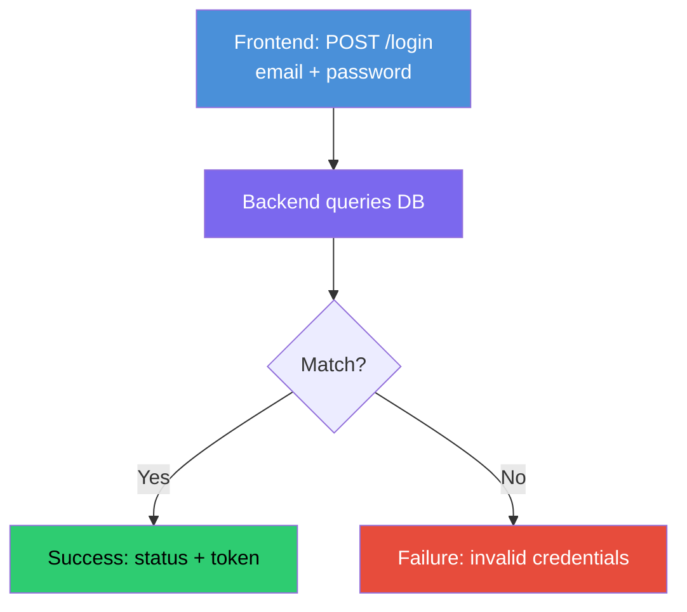

# DevTinder: Features, HLD, LLD & Planning

## What is DevTinder?

DevTinder is inspired by Tinder,, but for developers: a place for developers to connect and build professional networks. Right swipe = send connection request, left swipe = ignore. Has a matches view and a messages tab.

## Features

1. Create an account
2. Login
3. Update profile
4. Feed page: explore other developers
5. Send connection request
6. See matches
7. See requests sent
8. Review requests received

## Tech Stack

- **Backend**: Node.js, Express, MongoDB
- **Frontend**: React

Two microservices: frontend and backend.

## DB Design

**`user` collection**: firstName, lastName, emailId, password, age, gender, etc.

**`connectionRequest` collection**: fromUserId, toUserId, status

- Right swipe: `pending` -> `accepted` or `rejected`
- Left swipe: `ignored`
- Also possible: `blocked`

Connections need their own collection since it's a relationship between two users, not data that fits inside `user`.

## API Design

**REST API**: client sends HTTP requests (`GET`, `POST`, `PUT`, `DELETE`) to endpoints, server responds with JSON. Stateless: each request carries everything the server needs, no session stored between requests.

**HTTP methods (CRUD)**: `GET` fetch, `POST` create, `PUT`/`PATCH` update, `DELETE` remove.

### Planned Endpoints

1. `POST /signup`
2. `POST /login`
3. `GET /profile`
4. `POST /profile`
5. `PATCH /profile`
6. `DELETE /profile`
7. `POST /request` (ignore, interested)
8. `POST /request/review` (accept, reject)
9. `GET /request`
10. `GET /connections`
