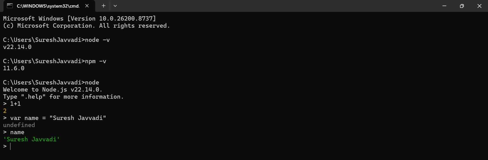

# Node.js Installation & Writing Code

## Installation

- Go to [nodejs.org/en/download](https://nodejs.org/en/download) and select the OS (Windows, macOS...) and architecture (X64, ARM64...), download the installer and follow the steps to install
- To check whether it is installed, run this command in terminal: `node -v`
- If Node.js is NOT installed, `node -v` will produce an error saying the command is not recognized or not found
- Along with Node, npm is also installed, check it with: `npm -v`
- `npm -v` displays the version of NPM (Node Package Manager) currently installed on your system

## Writing Code

- Quick and simple way to write code is using **REPL** (Read Evaluate Print Loop)
- To enter REPL just run this command: `node`
- Now it will allow you to run JS code, that is how Node became a JS runtime environment
- The code passed to it is run by the **V8 engine**
- REPL is similar to a browser console
- But generally, we use a code editor (VS Code) to write the code

## Writing Code in VS Code

- Create a new folder on your computer (e.g., `my-nodejs-project`)
- Open VS Code and go to **File > Open Folder**, select the folder you created
- Create a new file named `02-nodejs-installation.js` inside the folder
- To open terminal in VS Code use shortcut **Ctrl + backtick**, or use the system terminal
- Navigate to the file's parent folder and run: `node 02-nodejs-installation.js`
- Example file: [02-nodejs-installation.js](../../examples/02-nodejs-installation.js)

## Global Object in Node.js

- Node has a global object called **`global`**, like the `window` global object in the browser. It is one of the superpowers of Node. These superpowers are not part of V8
- The `window` object is provided by the **browser**, not by the V8 engine
- In Node.js, `global` is equivalent to `window` in the browser
- The `global` object offers various functionalities such as `setTimeout()`, `setInterval()`, and more
- `this` at the global level in Node.js outputs `{}` (empty object), it does not refer to the global object
- **`globalThis`** refers to the global object across all JS environments, including Node.js and browsers
- `globalThis` was introduced in **ECMAScript 2020** to provide a standardized way to refer to the global object in any environment
- In browsers: `globalThis === window`; in Node.js: `globalThis === global`
- `globalThis` keyword was introduced by the OpenJS Foundation, to replace the many different keywords (`self`, `frame`...) that previously referred to the global object
