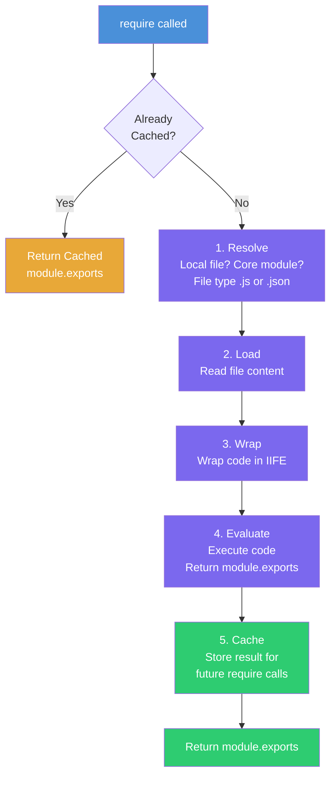

# Module Internals - Diving Deep into Node.js

## How Node.js Makes Modules Private

- When we call the `require` method and give the path, all the code of the module is wrapped in an IIFE function and run
- Because of function scope, we cannot access variables and functions from outside the module
- Node.js passes `module` and `require` as parameters to the IIFE, which is how we can use `module.exports`

```js
(function (module, require, ...) {
  // All the code inside the module runs here
})();
```

- Node.js gives the IIFE to the V8 engine to run

## IIFE (Immediately Invoked Function Expression)

- IIFE is a function that is created and immediately invoked
- It is different from a regular function which is defined and then called separately

```js
// Regular function
function x() {}
x();

// IIFE
(function () {
  // All the code inside the module runs here
})();
```

**The purpose of IIFE in Node.js:**
- Immediately invoke the code: the function runs as soon as it is defined
- Keep variables and functions private: by encapsulating the code within the IIFE, it prevents variables and functions from interfering with other parts of the code

## 5-Step Mechanism of require()



1. **Resolving the module:** checks whether the path is a local file (`./path`), a `node:` core module, and the type of file (`.js` or `.json`)
2. **Loading:** loads the file content from the module
3. **Wrapping:** wraps the module code inside an IIFE
4. **Evaluation:** after the code runs, it returns `module.exports`
5. **Caching:** this process runs only once, even if the same module is used in different modules. On subsequent `require()` calls, Node.js returns the cached `module.exports` instead of repeating all 5 steps

## Node.js Superpowers

- Node.js is an open-source project and all its source code can be found in the Node.js GitHub repo
- The `lib` directory in the Node.js repo contains the core JavaScript code for built-in modules like `http`, `fs`, `path`, and more
- `libuv` is the most powerful superpower of Node.js - it is the reason Node.js is popular
- `libuv` provides the underlying infrastructure for asynchronous I/O, event handling, and cross-platform compatibility
