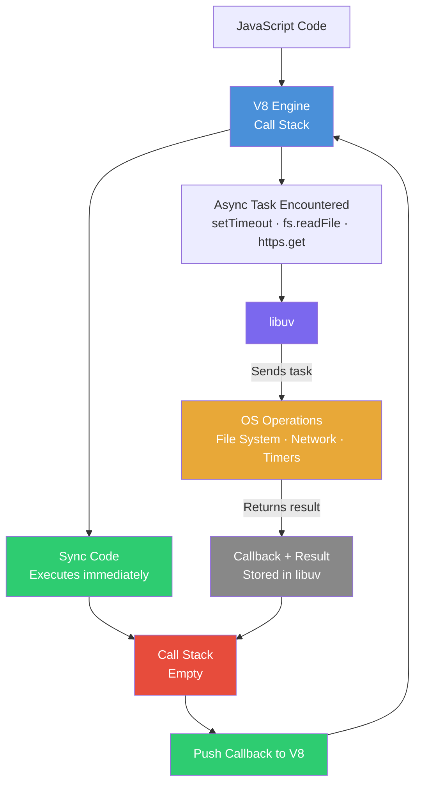

# Episode 04: libuv & Async I/O

## What is libuv?

libuv is a C library that made asynchronous I/O simple. Node.js uses libuv to give JavaScript its superpowers for handling asynchronous operations.

## JavaScript: Synchronous Single-Threaded Language

JavaScript is a synchronous, single-threaded language. This means code executes line by line, one after another, without overlap.

### What is a Thread?

A thread is the smallest unit of execution within a process in an operating system. It represents a single sequence of instructions.

- **Single-threaded**: Only one thread executes code at a time
- **Multi-threaded**: Multiple threads run simultaneously (like in C++ or Java)

JavaScript runs in a single thread, meaning only one operation can happen at a time. If you are executing line 2, it will only run after line 1 has finished.

### Synchronous vs Asynchronous

- **Synchronous system**: Tasks are completed one after another. Like one hand doing 10 tasks.
- **Asynchronous system**: Tasks are completed independently. Like 10 hands doing 10 tasks at the same time.

JavaScript itself is synchronous, but with the power of Node.js it can handle asynchronous operations.

## V8 Engine Internals

Inside the V8 JavaScript Engine:

- **Call stack**: Where all the code executes. The engine runs on a single thread.
- **Memory heap**: Stores all variables, numbers, and functions your code uses.
- **Garbage collector**: Automatically identifies and removes variables that are no longer in use, freeing memory.

All code runs in the call stack only.

## How Synchronous Code is Executed

When code is given to the V8 engine:

**Step 1: Global Execution Context (GEC) is created**

This is the main environment where top-level code executes. The GEC is always the first to be pushed onto the call stack.

**Step 2: Memory Creation Phase**

Before any code runs, the engine enters the memory creation phase. Variables are declared in memory and initialized to `undefined`. Function definitions are stored in full.

**Step 3: Code Execution Phase**

The engine runs line by line, assigning actual values to variables.

**Step 4: Function Invoked - Functional Execution Context (FEC) is created**

When a function is invoked, a new Functional Execution Context (FEC) is created and pushed onto the call stack. The function executes inside its own FEC.

**Step 5: FEC is popped after function returns**

When the function finishes and returns a result, its FEC is popped off the call stack. The GEC resumes from where it left off.

**Step 6: GEC is popped when all code finishes**

After all code has executed, the GEC is also popped from the call stack. The call stack becomes empty.

When synchronous code is given to the JS engine, it runs in a fraction of a second. It does not know how to wait.

```js
var a = 324242;
var b = 7104;

function multiply(a, b) {
  return a * b;
}

var c = multiply(a, b);
console.log("The result is:", c);

console.log("The End");
```

[sync.js](../../examples/04-libuv/sync.js)

## How Node.js Makes JS Asynchronous (libuv)

The JS engine is very good at running synchronous code but it does not know how to wait. For asynchronous code, it uses superpowers given by Node.js through a library called **libuv**.

- Whenever the JS engine encounters async code, it offloads the async task to libuv
- libuv can: access the OS, read files, make API calls, manage timers, handle database tasks, and more
- libuv acts as a middle layer: JS talks to libuv, libuv talks to OS, and returns the data

**How it works:**

1. When `https.get` / `setTimeout` / `fs.readFile` comes in the code, V8 offloads the task to libuv and continues executing synchronous code
2. libuv registers the task and stores its callback
3. When libuv gets the result from the OS, it sends the callback and result back to V8
4. V8 executes the callback once the call stack is empty

This is called **non-blocking I/O**.



```js
const https = require("https");
const fs = require("fs");

console.log("Async started");

var a = 324242;
var b = 7104;

https.get("https://dummyjson.com/products/1", (res) => {
  console.log("Fetched dummy data successfully");
});

setTimeout(() => {
  console.log("setTimeout called after delay of 5 Seconds");
}, 5000);

console.log("Surprise....!");

fs.readFile("./file.txt", "utf8", (err, data) => {
  console.log("File data", data);
});

function multiply(a, b) {
  return a * b;
}

var c = multiply(a, b);
console.log("The result is:", c);

console.log("The End");
```

[async.js](../../examples/04-libuv/async.js)

**Important:** libuv pushes callbacks to V8 only when the call stack is empty. This means any callback executes only after all synchronous code has finished, even if libuv already has the result.

## Blocking the Main Thread

We can block the main thread using synchronous functions. Every async function has a sync version, but they do not have much practical use in real applications.

**Best practice:** Avoid synchronous methods in production code, especially in performance-critical applications. Instead, use the asynchronous version so other operations can continue while the task runs.

**Note:** Any function ending with `Sync` (like `readFileSync`, `pbkdf2Sync`) is synchronous and will block the main thread while it runs.

### crypto Module

Node.js has a built-in `crypto` module used for cryptographic operations like generating secure keys and hashing passwords. One of its functions is `pbkdf2` (Password-Based Key Derivation Function).

`pbkdf2Sync` takes these parameters:

- **Password and Salt**: Combined to create a cryptographic key
- **Iterations**: Number of iterations to increase complexity (harder to crack)
- **Digest Algorithm**: Like `sha512`, determines how the key is hashed
- **Key Length**: Length of the generated key in bytes

```js
const fs = require("fs");
const crypto = require("crypto");

// async function
fs.readFile("./file.txt", "utf8", (err, data) => {
  console.log("File data", data);
});

// blocks the main thread
fs.readFileSync("./file.txt", "utf8");
console.log("Sync File data");

// pbkdf2 - Password Based Key Derivative Function
const key = crypto.pbkdf2Sync("Suresh@123", "salt", 500000, 50, "sha512");
console.log("sync Key is generated", key);

crypto.pbkdf2("Suresh@123", "salt", 50000, 50, "sha512", (err, key) => {
  console.log("Async Key is generated", key);
});

function multiply(a, b) {
  return a * b;
}

var c = multiply(a, b);
console.log("The result is:", c);

console.log("The End");
```

[blocking.js](../../examples/04-libuv/blocking.js)

Here the main thread is blocked until `pbkdf2Sync` generates the key. Even though the JS engine offloads the task to libuv, it waits for the result to come back, so the main thread is blocked.

## setTimeout(0): Trust Issues

> **Interview Tip:** This is a tricky output question!

Even when `setTimeout` delay is set to `0`, the callback will not execute right away. It executes only when the main thread (call stack) is empty.

libuv pushes callbacks to V8 only when the call stack is empty. So even if libuv already has the result, it will not send the callback until all synchronous code finishes.

There are "trust issues" with `setTimeout` because even after the given delay time passes, it won't execute if the main thread is busy or blocked.

```js
var a = 324242;
var b = 7104;

// even the callback timer is done, it won't print right away
setTimeout(() => {
  console.log("Call me right now");
}, 0);

setTimeout(() => {
  console.log("Call me after 3 seconds");
}, 3000);

function multiply(a, b) {
  return a * b;
}

var c = multiply(a, b);
console.log("The result is:", c);

console.log("The End");
```

[setTimeoutZero.js](../../examples/04-libuv/setTimeoutZero.js)

Output order:

```
The result is: 2304156768
The End
Call me right now
Call me after 3 seconds
```

"Call me right now" prints after "The End" because the `setTimeout(0)` callback only executes after the call stack is empty.
