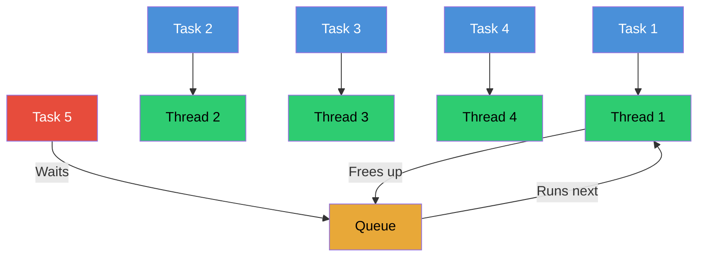

# Episode 07: Thread Pool in libuv

## Thread Pool

When libuv gets async tasks, most of the time it runs the OS operations in the UV thread pool.

- There are **4 threads** in the UV thread pool by default. Each thread does one async task and is freed when that task is completed. Using these threads, libuv performs tasks without blocking the main thread.
- The tasks that use the thread pool are: **file system (`fs`)**, **`dns.lookup`**, **crypto**, and **user-specified** tasks.
- Whenever there is an asynchronous task, V8 offloads it to libuv. For example, when reading a file, the `fs` call is assigned to a thread in the pool, and that thread makes a request to the OS. While the file is being read, that thread is fully occupied and cannot do any other work. Once the read is complete, the thread is freed and becomes available again.

## 4 Tasks at a Time

libuv can run 4 async tasks at a time. If there are more than 4 tasks, the others wait until one of the threads is freed.

The default size is set through this environment variable:

```text
UV_THREADPOOL_SIZE=4
```

If you make 5 simultaneous calls, 4 of them occupy the 4 threads, and the 5th waits until a thread becomes free.



```js
const crypto = require("crypto");

crypto.pbkdf2("password", "salt", 100000, 512, "sha512", () => {
  console.log("1- crypto.pbkdf2 done");
});

crypto.pbkdf2("password", "salt", 100000, 512, "sha512", () => {
  console.log("2- crypto.pbkdf2 done");
});

crypto.pbkdf2("password", "salt", 100000, 512, "sha512", () => {
  console.log("3- crypto.pbkdf2 done");
});

crypto.pbkdf2("password", "salt", 100000, 512, "sha512", () => {
  console.log("4- crypto.pbkdf2 done");
});

crypto.pbkdf2("password", "salt", 100000, 512, "sha512", () => {
  console.log("5- crypto.pbkdf2 done");
});
```

1, 2, 3, 4 give their output together, but 5 runs after them because the default thread pool size is 4.

[app.js](../../examples/07-thread-pool/app.js)

## Execution Order Is Not Guaranteed

The order of execution is not guaranteed. Whichever thread finishes first "wins", so the completion order of the tasks running in parallel can vary between runs.

## Is Node.js Single-threaded or Multi-threaded?

It depends on the code and the tasks you give it:

- If you give **synchronous code**, Node.js is **single-threaded**.
- If you give **async tasks** like `fs`, `dns.lookup`, crypto, or user-specified tasks, it uses libuv's thread pool, making it **multi-threaded**.

## Adjusting the Thread Pool Size

You can adjust the size of the thread pool using the `UV_THREADPOOL_SIZE` environment variable.

```js
process.env.UV_THREADPOOL_SIZE = 2; // adding this line in the js file is not working in modern node
```

**Note:** This line is ignored on modern Node. The pool size should be set at startup, before the code runs.

The only reliable way is to set the real environment variable before Node starts:

```text
PowerShell : $env:UV_THREADPOOL_SIZE=2; node adjust.js
Git Bash   : UV_THREADPOOL_SIZE=2 node adjust.js
```

With a pool size of 2, tasks finish in pairs: 1 and 2 first, then 3 after a thread frees up. You can also raise the pool size to a bigger number if your production system involves heavy file handling or other tasks that benefit from additional threads.

[adjust.js](../../examples/07-thread-pool/adjust.js)

## API Calls Do Not Use the Thread Pool

API calls do not use the UV thread pool. Instead, they use **epoll (Linux)** and **kqueue (macOS)** to handle multiple API requests and manage the socket descriptors.

- `epoll` and `kqueue` are **scalable I/O event notification mechanisms**.
- When you create an `epoll` or `kqueue` descriptor, it monitors multiple file descriptors (sockets) for activity.
- The OS kernel manages these mechanisms and notifies libuv when some API call happens or some event occurs on the sockets.
- libuv then gets the callback and gives it to the call stack. This is how Node follows an **event-driven architecture**.
- This approach lets the server handle a large number of connections efficiently without creating a thread for each one.

## File Descriptors and Socket Descriptors

- **File Descriptors (FDs)** are integral to Unix-like operating systems, including Linux and macOS. They are used by the OS to manage open files, sockets, and other I/O resources.
- **Socket descriptors** are a special type of file descriptor used to manage network connections. They are essential for network programming, allowing processes to communicate over a network.
