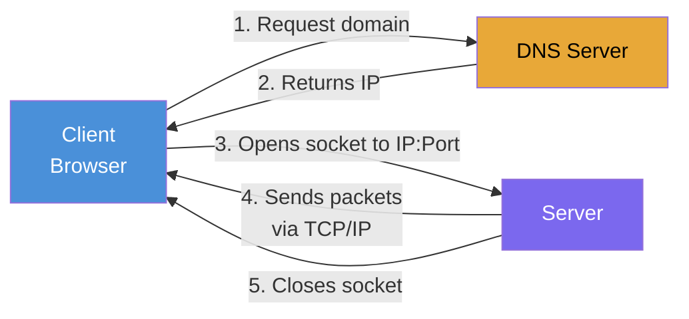

# Episode 08: How the Web Works

## What is a Server?

A **server** is hardware or software, depending on the context. Sometimes the word refers to hardware, sometimes to software.

- **Hardware**: a physical machine (computer) that provides resources and services to other computers (clients) over a network. Example: "deploy on a server".
- **Software**: an application or program that handles requests and delivers data to clients. Example: "a network call to a server".

### Deploying an Application on a Server

When someone says "deploy your app on a server", they usually mean:

1. **Hardware**: a physical machine (with CPU, RAM, storage) to run your application.
2. **Operating System (OS)**: the hardware runs an OS like Linux or Windows, and your application runs on that OS.
3. **Server Software**: the software (for example a web server like Apache, or an application server built with Node.js) that handles requests from users.

## Can You Use Your Own Laptop as a Server?

Yes, but with limitations:

- **Hardware constraints**: a laptop has limited RAM, CPU, and storage, which may not handle a large number of requests.
- **Internet connectivity**: a home internet connection is less reliable and usually has a dynamic IP, making it unsuitable for hosting a publicly accessible server.
- **Power and maintenance**: keeping the laptop always on, connected, and backed up is challenging.

This is why cloud providers exist. **AWS (Amazon Web Services)** provides cloud-based servers. When you launch an **EC2 instance**, you are renting a virtual server from AWS. AWS manages the underlying hardware and gives you scalability (increase memory or processing power with a few clicks) and reliability (constant power, backup, redundancy).

## Client-Server Architecture

Whenever a client accesses the server, it establishes a **socket connection**. The server software listens for the request and responds with data from the server hardware, then closes the socket.



- There can be multiple clients, and each client creates its own socket connection to get data. After the data is received, the socket is closed. If the client needs to make another request, a new socket connection is created, data is retrieved, and the connection is closed again.
- When the socket is made, it uses the **TCP/IP protocol** (Transmission Control Protocol / Internet Protocol), which is a set of rules for making connections and sending data.

## Protocols

The client and server use protocols like **HTTP, FTP, SMTP** to talk and exchange data. These are basically the languages of clients and servers.

- **HTTP (HyperText Transfer Protocol)**: the set of rules that defines how clients and servers communicate. When we talk about a web server, we usually mean an HTTP server.
- **FTP (File Transfer Protocol)**: used for transferring files.
- **SMTP (Simple Mail Transfer Protocol)**: used for sending emails.

## Packets

Based on TCP/IP, the data is transferred in the form of small chunks called **packets**. Whenever data is transmitted, it is broken down into these packets. The TCP/IP protocol is responsible for sending these packets and ensuring the data transmission is properly managed.

## DNS (Domain Name System)

When you make a request from the browser with a domain, it makes a call to **DNS**, where the domain and IP are mapped, and gives that IP back to the browser. With that IP, the socket connection is established and data is transferred.

- We don't generally communicate using IP addresses. Instead, we use domain names like `youtube.com`, but everything ultimately maps to an IP address.
- Similar to how we save contacts with names instead of memorizing phone numbers, a domain name is translated into an IP address by the DNS server.

## Multiple Servers and Ports

We can have multiple servers (software) on a single server (hardware).

- When a client requests a server that hosts multiple servers, how does it know which server (software) to connect to? This is defined by assigning a **port number** to each server.
- So the client's request looks like this: **IP:PORT**.
- A port is typically a 4-digit number (for example, port 3000).

The domain name is mapped to a server **IP**, and the **port** selects which application receives the request on that server.

- Example: `sureshjavvadi.com` could point to a React application running on port `3000`.
- Example: `sureshjavvadi.com/api` could point to a Node.js application running on port `3001`.

This way, a single computer (the server) can run multiple applications, and the port number decides which application the request is directed to, while the path decides which route inside that application handles it.

### Where is the Port in a URL?

In real URLs you usually do not see a port:

```text
https://sureshjavvadi.com        gets the frontend UI
https://sureshjavvadi.com/api    gets the API
```

The port is still there, it is just hidden because it is the default. `https` always uses port **443** and `http` always uses port **80**, so the browser does not show it.

```text
https://sureshjavvadi.com        is really  https://sureshjavvadi.com:443
https://sureshjavvadi.com/api    is really  https://sureshjavvadi.com:443/api
```

Both URLs hit the same server on the same port (443). So how does one give the UI and the other give the API? A **reverse proxy** (like Nginx) sits on port 443, reads the path, and forwards the request internally:

- `/`    goes to the React app on an internal port (for example `3000`) and returns the frontend UI
- `/api` goes to the Node.js app on an internal port (for example `3001`) and returns the API

The order is:

1. **Port 443**: gets the request into the server (to the reverse proxy). This is the same for both URLs.
2. **Path** (`/` vs `/api`): decides which internal app (and its internal port) handles the request.

This is why `/api` is a **path**, not a port. The path is what triggers routing to a particular internal port, but the path itself is not the port. The internal ports (`3000`, `3001`) exist on the server, but the user never sees or types them.

A path can be configured to forward to a different port, but it does not inherently mean a port. The same path can map to the same port or a different one, depending entirely on the setup:

- **Different ports**: `/` goes to the React app on `3000`, `/api` goes to the Node app on `3001`.
- **Same port**: `/` and `/api` both go to the same app on the same port, and the app just runs different code based on the path.

The `server.js` example below shows the same-port case: both `/secret` and `/` hit the same port `7104`, and only the response changes based on the path.

- A **port** decides which program gets the request.
- A **path** decides what that program does with the request.

## Distributed Server Architecture

Not only do clients connect to servers, but servers also connect to other servers to build the response for the client's request. In large companies, the architecture is often distributed across multiple servers rather than a single server, which helps with scalability, reliability, and performance.

- **Frontend Server**: handles the UI, serving the HTML, CSS, and JavaScript files the browser needs.
- **Backend Server**: processes the logic, handles requests, and interacts with the database.
- **Dedicated Database Server**: a separate, powerful server optimized for storing and managing data.
- **Media and File Servers**: large files like videos and images are stored on specialized servers, often delivered through a **CDN (Content Delivery Network)** for fast worldwide delivery.
- **Inter-Server Communication**: when a client makes a request, the frontend or backend server may call other servers to get the necessary data (for example, fetching a video from a media server) and then send it back to the client.

## Socket vs WebSocket

- **Socket**: used to open a connection and close it once the response is given. It is typically used for a single request-response cycle, opening a new connection for each request.
- **WebSocket**: unlike a socket, it keeps the connection open longer so that continuous, two-way communication can happen between the client and the server.

## Creating a Server in Node.js

To create a server in Node.js, we can use Node's core module called **`http`**.

```js
const http = require("http");

const server = http.createServer((req, res) => {
  if (req.url === "/secret") {
    res.end("There is no secret page");
  }
  res.end("Hello World");
});
server.listen(7104);
```

This is the native Node way to create a server. **Express** is a framework used to create a server and handle incoming requests more easily.

[server.js](../../examples/08-how-web-works/server.js)
