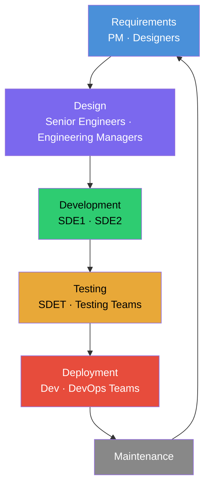

# Episode 11: Microservices vs Monolith

## SDLC (Software Development Life Cycle)

Companies follow the SDLC (Software Development Life Cycle). One of the most used SDLC models is the **Waterfall model**.

1. **Requirements**: handled by PM (Product Manager) and Designers.
2. **Design**: handled by Senior Engineers / Engineering Managers.
3. **Development**: handled by SDE1, SDE2.
4. **Testing**: handled by SDET and Testing Teams.
5. **Deployment**: handled by dev and DevOps teams.
6. **Maintenance**: goes back to step 1 (Requirements) and the cycle repeats.

## Microservice Architecture

**Microservices**: one repo for each service, and all services are interconnected under the project.

In microservice architecture, the application is divided into smaller, independent services, each responsible for a specific feature or functionality. For example:

- A **notification** microservice that handles all user notifications.
- An **authentication** microservice that manages user login and security.

Each microservice is developed, deployed, and maintained separately, often by different teams. This allows for greater flexibility, scalability, and ease of maintenance.

In large companies there are dedicated teams managing individual microservices. For example, one team handles the fare calculation microservice, and another team handles the cab booking microservice. This separation of concerns improves efficiency and enables teams to work independently.

## Monolithic Architecture

**Monolith**: all the services live in the same repository.

A monolith is a large, single codebase that contains everything a project needs to function, including:

- Database (DB)
- Frontend (user interface)
- Backend (business logic)
- Authentication
- Code for additional features like analytics

In a monolithic architecture, all components are tightly integrated and exist within a single repository. This can be simple to start with, but it becomes harder to maintain as the project grows. Updates or changes to one part of the system can affect other components, making development and deployment more complex.

## Detailed Comparison

| #   | Aspect                 | Monolith                                                                                                       | Microservices                                                                                              |
| --- | ---------------------- | -------------------------------------------------------------------------------------------------------------- | ---------------------------------------------------------------------------------------------------------- |
| 1   | Development Speed      | Slower, since all developers work on a single large codebase, leading to code conflicts and longer merge times | Faster, since each service has its own repository and teams work independently                             |
| 2   | Code Repositories      | Single repository for the entire project, which slows down development with larger teams                       | Multiple repositories, each dedicated to a service, enabling faster development and better version control |
| 3   | Scalability            | Difficult to scale since all components are tightly coupled                                                    | Easier to scale, since each service can be scaled independently based on demand                            |
| 4   | Deployment             | Deploying means redeploying the entire system, even for minor changes                                          | Services can be deployed independently, though managing multiple deployments adds complexity               |
| 5   | Tech Stack Flexibility | Restricted to a single tech stack across the whole application                                                 | Different services can use different technologies (e.g. React for one, Angular for another)                |
| 6   | Infrastructure Cost    | Generally lower, since only a single server or environment is managed                                          | Often higher, due to multiple servers and separate teams                                                   |
| 7   | Complexity             | Easier to manage for small projects, harder to maintain as it grows                                            | More complex to set up for small projects, but easier to scale and maintain for large ones                 |
| 8   | Fault Isolation        | A failure in one part can crash the entire application                                                         | Faults are isolated to individual services; only the affected service crashes                              |
| 9   | Testing                | Easier to write tests since everything is in one place, but harder to maintain as the codebase grows           | Harder due to the distributed nature of services, but allows testing services independently                |
| 10  | Ownership              | Centralized ownership, with all teams contributing to a single codebase                                        | Each team owns its respective service, giving more accountability and autonomy                             |
| 11  | Maintenance            | Becomes harder over time as the codebase grows                                                                 | Easier, since services are decoupled and smaller                                                           |
| 12  | Reworks and Revamps    | Large-scale changes are challenging due to tight coupling                                                      | Easier, since you can modify one service without affecting others                                          |
| 13  | Debugging              | Simpler since everything is in one place, but large codebases can still be hard to navigate                    | Tougher, since it involves multiple services and can lead to a "blame game" between teams                  |
| 14  | Developer Experience   | Developers can feel restricted by the single codebase and limited tech stack                                   | Many developers prefer the flexibility, independence, and varied tech stacks                               |
