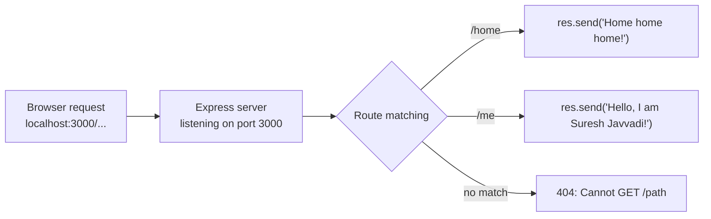

# Creating an Express Server and Project Setup

## Setting Up the Project

- Create a folder with the project name
- Run `npm init` in the terminal
- Answer the questions and press Enter, it will create a `package.json`
  - **Package name:** choose a name for your package
  - **Description:** anything you want
  - **Entry point:** leave as default
  - **Test command:** not needed for now
  - **Keywords:** e.g. `nodejs`, `backend`
  - **Author:** your name
- `package.json` is the configuration of the project. It is like an index of the project: it tells the metadata of the project

See the project's [package.json](../../dev-tinder/package.json)

## What Is Express.js?

Express.js, often called Express, is a popular, minimalist, and flexible web application framework for Node.js. It provides a robust set of features for building web applications and APIs quickly and efficiently, compared to building a server in pure Node.js.

Key characteristics and features:

- **Server-side development:** simplifies building server-side applications with an easy-to-use API for routing, middleware, and handling HTTP requests and responses
- **Routing:** define different routes (paths) and associate them with functions to handle requests
- **Middleware:** integrate functions that process requests and responses at different stages (logging, authentication, input validation, error handling)
- **HTTP utilities:** methods for managing request and response objects, like sending strings or JSON, setting status codes, and handling file downloads
- **Template engines:** works with EJS, Pug, or Handlebars for server-side rendering of HTML pages
- **Building APIs:** widely used to create RESTful APIs that handle CRUD operations
- **Scalability and flexibility:** lightweight and modular design, suitable for microservices
- **Open source:** free under the MIT License, with a large and active community

## Installing Express

- We need a server to listen for requests. We use Express.js to create the server
- To use Express, install it in the project: run `npm i express`
- `node_modules` and `package-lock.json` will be created in the project, and a `dependencies` object is added in `package.json`

### node_modules

- All the source code and dependencies of Express are stored here
- Express has its own dependencies too: open `node_modules/express/package.json` and you will see the dependencies that Express itself depends on. That is the beauty of open source software

### dependencies object

- Stores the dependency names and the versions the project should use

```json
"dependencies": {
  "express": "^5.2.1"
}
```

- In the version, `^` (caret) and `~` (tilde) can be there
  - `^` (caret): defines the allowed version range. It does not update anything while the app runs; when you run `npm install` (or `npm update`) again, npm can pick up a newer minor or patch version, but not a new major version
    - Example: `^5.19.2` can install `5.19.3` or `5.20.0`, but not `6.x.x`
    - You can remove the `^`, but then npm will install exactly that version and no updates
  - `~` (tilde): allows only patch updates
    - Example: `~5.19.2` can install `5.19.3`, but not `5.20.0`

### package-lock.json

- Tells the exact versions used by the project. Since `^` allows auto-updating minor and patch versions, `package-lock.json` locks the exact versions of all installed packages and their dependencies, ensuring everyone working on the project has the same environment

## Creating the Server

```js
const express = require("express");

const app = express(); // create a server instance using express

app.listen(3000, () => {
  console.log("Server is listening on port 3000");
}); // listen to port 3000, we can request the server using localhost:3000
```

- When you make a change and save the file, those changes do not reflect in the currently running server. You need to kill it (Ctrl+C) and restart the server (`node src/app.js`)

Code: [app.js](../../dev-tinder/src/app.js)

## Request Handler



- A request handler will handle the requests and send the response

```js
app.use((req, res) => {
  res.send("Hello from the server!"); // request handler, sends the same response for every path
});
```

- We can add a route as the 1st parameter to handle different requests

```js
app.use("/home", (req, res) => {
  res.send("Home home home!"); // for home path
});

app.use("/me", (req, res) => {
  res.send("Hello, I'm Suresh Javvadi!");
});
```

- For other paths, it will throw a Cannot GET /path error (404)

```text
Cannot GET /asd   // error message on browser
```

- If we do not pass the route, then the server always sends the same response for all paths

```js
app.use((req, res) => {
  res.send("Hello from the server!"); // matches every path
});

app.use("/home", (req, res) => {
  res.send("Home home home!"); // never reached, the handler above catches everything
});
```

Code: [app.js](../../dev-tinder/src/app.js)

## Auto-Restarting the Server: node --watch and Nodemon

- Killing and restarting the server after every change is annoying. We need a watcher that restarts the server whenever a file is saved
- **node --watch (preferred):** Node 20+ has this built in: `node --watch src/app.js` restarts the server on every save. No extra package to install, it works on any machine right after `npm install`
- **Nodemon (alternative):** a separate package that does the same job: run `npm i -g nodemon` to install it globally, then `nodemon src/app.js`. A global install is not recorded in `package.json`, so on a new machine it must be installed again before the script works

## npm Scripts

- Simply add commands to the `scripts` object in `package.json` to run regular commands

```json
"scripts": {
  "test": "echo \"Error: no test specified\" && exit 1",
  "start": "node src/app.js",
  "dev": "node --watch src/app.js",
  "dev:nodemon": "nodemon src/app.js"
}
```

- `npm run dev`: runs the server using Node's built-in watcher (preferable during development). No extra package is needed, `--watch` ships with Node 20+, so the script works on any machine right after `npm install`
- `npm run dev:nodemon`: runs the server using nodemon. Note that a global nodemon install is not recorded in `package.json`, so on a new machine this script needs `npm i -g nodemon` first
- `npm run start`: runs the server using node (no restart on file changes)

See the project's [package.json](../../dev-tinder/package.json)
