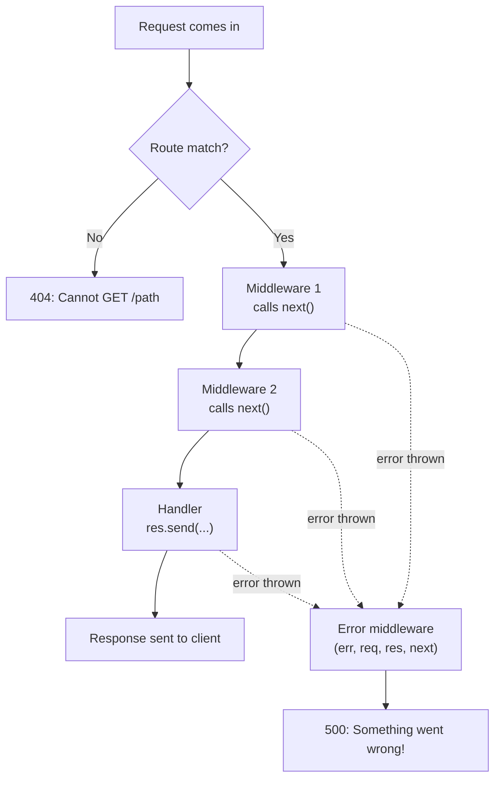

# Middlewares and Error Handling

## Middlewares

- In the route handler, if you do not send the response, then the request will hang and keep on loading

```js
app.use("/middleware", (req, res, next) => {
  // res.send("Middleware executed");
});
```

- The request still reaches the server, you can see the log in the terminal

```js
app.use("/middleware", (req, res, next) => {
  console.log("Middleware executed");
  // res.send("Middleware executed");
});
```

- You can send multiple route handlers in one route: the 1st parameter is the path, the 2nd parameter is a route handler, the 3rd is also a route handler, and like that you can pass multiple handlers

```js
app.use(
  "/middlewareMulti",
  (req, res) => {
    console.log("Middleware executed");
    res.send("Middleware executed");
  },
  (req, res) => {
    console.log("Middleware executed again");
    res.send("Middleware executed again");
  },
);
```

- Note: in this example only the first handler runs. Control is never passed to the second one, so "Middleware executed again" is dead code
- To send the response using the next route handler, you need to pass the control by using `next()`

```js
app.use(
  "/middlewareMulti",
  (req, res, next) => {
    console.log("Middleware executed");
    next(); // call next middleware
  },
  (req, res, next) => {
    console.log("2 Middleware executed");
    res.send(" 2 Middleware executed");
  },
);
```

- Once `res.send()` runs, the HTTP response (headers and body) is already sent to the client. If you try to send a response again from the next handlers, you will get an error, because headers cannot be sent twice. The socket itself often stays open for reuse (keep-alive): it is the response that is finished, not the socket

```js
app.use(
  "/middlewareMultiWithResponse",
  (req, res, next) => {
    console.log("Middleware executed");
    res.send("Middleware executed");
    next(); // call next middleware
  },
  (req, res, next) => {
    console.log("2 Middleware executed");
    res.send(" 2 Middleware executed");
  },
);
```

```text
Error [ERR_HTTP_HEADERS_SENT]: Cannot set headers after they are sent to the client
```

- If there is no request handler after `next()`, then we get an error like cannot find path

```js
app.use(
  "/middlewareMultiWithoutHandler",
  (req, res, next) => {
    console.log("Middleware executed");
    next(); // call next middleware
  },
  (req, res, next) => {
    console.log("2 Middleware executed");
    next();
  },
);
```

```text
Cannot GET /middlewareMultiWithoutHandler
```

- You can use n number of route handlers in one route, but at the last one you need to send the response. If not, it leads to the error above

### Wrapping handlers in an array

- You can wrap the request handlers in an array

```js
// app.use("/path", [rh1, rh2, rh3, rh4, rh5]) wrap all and pass

// app.use("/path", rh1, [rh2, rh3], rh4, rh5) wrap some and pass
```

- Wrap all handlers, from the project:

```js
app.use("/wrapall", [
  (req, res, next) => {
    console.log("Middleware executed");
    next(); // call next middleware
  },
  (req, res, next) => {
    console.log("2 Middleware executed");
    next();
  },
  (req, res, next) => {
    console.log("3 Middleware executed");
    next();
  },
  (req, res, next) => {
    console.log("4 Middleware executed");
    next();
  },
  (req, res, next) => {
    console.log("5 Middleware executed");
    res.send("5 Middleware executed with wrap all");
  },
]);
```

- Wrap only some handlers, from the project:

```js
app.use(
  "/wrapsome",
  (req, res, next) => {
    console.log("Middleware executed");
    next(); // call next middleware
  },
  (req, res, next) => {
    console.log("2 Middleware executed");
    next();
  },
  [
    (req, res, next) => {
      console.log("3 Middleware executed");
      next();
    },
    (req, res, next) => {
      console.log("4 Middleware executed");
      next();
    },
  ],
  (req, res, next) => {
    console.log("5 Middleware executed");
    res.send("5 Middleware executed with wrap some");
  },
);
```

### Independent routes with the same path

- You can use `next()` across different independent routes with the same route path, but the sequence is important

```js
app.use("/independent", (req, res, next) => {
  console.log("Independent Middleware executed");
  next();
});
app.use("/independent", (req, res, next) => {
  console.log("2 Independent Middleware executed");
  res.send("2 Independent Middleware executed");
});
```

### What is a middleware?

- While using `next()`, all the functions before the function that sends the response to the request are called middlewares (it is developer lingo)

```js
app.use("/middlewares", (req, res, next) => {
  console.log("1 Middleware executed");
  next(); // call next middleware
});
app.use("/middlewares", (req, res, next) => {
  console.log("2 Middleware executed");
  next(); // call next middleware
});
app.use("/middlewares", (req, res, next) => {
  console.log("3 Middleware executed");
  next(); // call next middleware
});
app.use("/middlewares", (req, res, next) => {
  console.log("4 Middleware executed");
  res.send("4 Middleware executed");
});
```

- Here 1, 2, and 3 are middlewares
- The flow of Express: when the request is sent, it matches the path and goes through the middleware chain if `next()` is used, and the request is handled with a response. If not, it results in an error



Code: [app.js](../../dev-tinder/src/app.js)

### Actual importance and real use case of middleware

```js
app.get("/admin/getalldata", (req, res) => {
  res.send("All data retrieved");
});

app.delete("/admin/deleteuser", (req, res) => {
  res.send("User deleted");
});
```

- We need to check whether the request is from an admin: if admin, then respond, else throw an error

```js
app.get("/admin/getalldata", (req, res) => {
  const token = "admin-token"; //req.headers.authorization; // get token from headers
  if (token !== "admin-token") {
    return res.status(401).send("Unauthorized");
  }
  res.send("All data retrieved");
});
```

- By default, the status code is 200. You can change it by using `res.status(code)`. Find more about status codes here: [MDN HTTP Status Codes](https://developer.mozilla.org/en-US/docs/Web/HTTP/Reference/Status)
- But here we need to write this logic on every route to check the authorization, and that makes the code redundant. To solve that, middleware works

```js
app.use("/admin", (req, res, next) => {
  const token = "admin-token"; //req.headers.authorization; // get token from headers
  if (token !== "admin-token") {
    return res.status(401).send("Unauthorized request");
  }
  next();
});
```

- If you write this on top, every `/admin` path will go through this first, then go to the dedicated path

### The standard way of using middleware

- Keep the middlewares in a separate file and import them where needed

```js
const { adminAuth, userAuth } = require("./middlewares/auth");

app.use("/admin", adminAuth);

app.get("/admin/getalldata", (req, res) => {
  res.send("All data retrieved"); // this will be executed only if the admin auth middleware passes
});

app.get("/user/getprofile", userAuth, (req, res) => {
  res.send("User profile retrieved"); // this will be executed only if the user auth middleware passes
});
```

- The middleware file:

```js
const adminAuth = (req, res, next) => {
  console.log("admin auth getting check");
  const token = "admin-token"; //req.headers.authorization; // get token from headers
  if (token !== "admin-token") {
    return res.status(401).send("Unauthorized request");
  }
  next();
};

const userAuth = (req, res, next) => {
  console.log("user auth getting check");
  const token = "user-token"; //req.headers.authorization; // get token from headers
  if (token !== "user-token") {
    return res.status(401).send("Unauthorized request");
  }
  next();
};

module.exports = {
  adminAuth,
  userAuth,
};
```

- If you want to skip auth for some routes, do not pass the auth middleware

```js
app.get("/user/login", (req, res) => {
  res.send("User logged in");
});
```

Code: [app.js](../../dev-tinder/src/app.js), [middlewares/auth.js](../../dev-tinder/src/middlewares/auth.js)

## Error Handling

- If an error is thrown, then it will throw a big error and also expose some code, line details, and internals

```js
app.get("/errorhandler", (req, res) => {
  throw new Error("This is a test error");
});
```

```text
Error: This is a test error
    at S:\Projects\node-js-learning-roadmap\dev-tinder\src\app.js:251:9
    at Layer.handleRequest (S:\Projects\node-js-learning-roadmap\dev-tinder\node_modules\router\lib\layer.js:152:17)
```

- To handle errors gracefully, use this middleware at the end of the app

```js
app.use("/", (err, req, res, next) => {
  console.error(err.stack);
  // store the error in a log file or database for further analysis
  res.status(500).send("Something went wrong!");
});
```

- With `/`, every path will go through this: if any path gets an error, this will take care of it
- `err` should be the 1st parameter
- You can store the error in a log file or database for further analysis
- Placement rule: the error middleware only catches errors from routes registered above it. Register it after all the routes it protects, at the very end of the app, just before `app.listen`

### Express makes that function very dynamic

- If you pass:
  - two parameters: 1st is request, 2nd is response
  - three parameters: 1st is request, 2nd is response, 3rd is next
  - four parameters: 1st is error, 2nd is request, 3rd is response, 4th is next
- This order is very strict

### try/catch first, error middleware as safety net

- Generally, you need to use the try catch method and handle the error in the catch block. But still some errors may come, and for those use the error middleware

```js
app.get("/trycatcherror", (req, res) => {
  try {
    // code that may throw an error
    throw new Error("This is a test error");
  } catch (err) {
    console.error(err.stack);
    res.status(500).send("Something went wrong contact support!");
  }
});
```

- Use the error middleware at the end of the application, so if any error is not handled, it takes care of that without sending an error message that exposes the code

Code: [app.js](../../dev-tinder/src/app.js)
