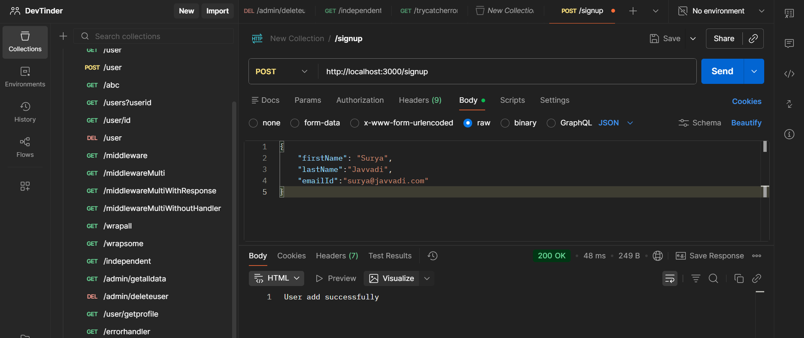
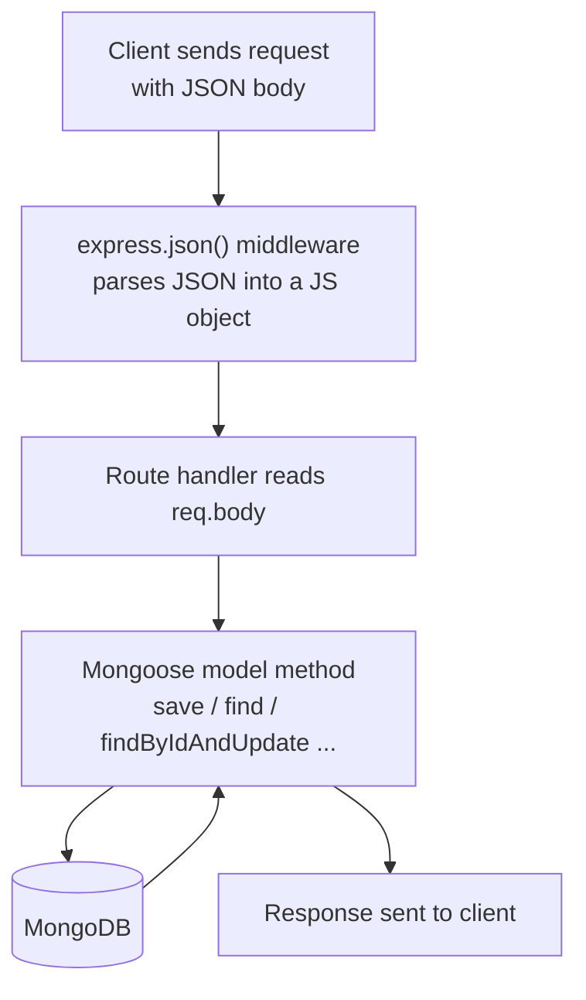

# APIs and CRUD

## Sending Dynamic Data to an API

- To pass dynamic data through the API request, you have many options. For passing the data, JSON is the best form



- When you send the data from Postman/client, the request is captured in the request parameter of the route/API, specifically in `req.body`

```js
app.post("/signupdynamic", async (req, res) => {
  console.log(req.body);
});
```

- But you will get `undefined`: Express cannot read any request body format on its own, whether it is JSON, text, XML, or form-data. Each format needs a middleware to parse it.

### express.json() middleware

- To read the JSON, you need to use a middleware: `express.json()`. It will read the JSON, convert it into a JS object, and append it to the request
- This applies to every HTTP method: `express.json()` parses the body only when the request's `Content-Type` is `application/json`. If there is no body or it is a different format (form-data, text), `req.body` stays `undefined`
- This middleware is needed for any API that receives a JSON body (POST, PATCH, etc.). GET routes without a body work fine without it, but registering it globally with `app.use` without a path at the top is the convenient standard

```js
app.use(express.json()); // every request passes through it
```

- Create a user instance with the model and pass `req.body` (the JS object)

```js
app.post("/signupdynamic", async (req, res) => {
  console.log(req.body);
  const user = new User(req.body);

  try {
    await user.save();
    res.send("User add successfully");
  } catch (error) {
    res.status(400).send("Error saving user" + error.message);
  }
});
```



Code: [app.js](../../dev-tinder/src/app.js)

## Reading Data from the Database

- Get the data from the database:

```js
app.get("/userbyemail", async (req, res) => {
  const userEmailId = req.body.emailId;

  try {
    const user = await User.find({ emailId: userEmailId });

    if (user.length === 0) {
      res.status(404).send("User not found");
    } else {
      res.send(user);
    }
  } catch (error) {
    res.send("Something went wrong");
  }
});
```

- Note: Postman allows a GET body, but browsers/fetch do not send bodies with GET. Real-world GET APIs receive inputs via query params (`req.query`) or route params (`req.params`) instead
- `Model.find({filter})`: searches with the filter and gives all matching documents
- If you do not give any filters, you will get all documents

```js
app.get("/feed", async (req, res) => {
  try {
    const users = await User.find({});

    if (users.length === 0) {
      res.status(404).send("Users not found");
    } else {
      res.send(users);
    }
  } catch (error) {
    res.send("Something went wrong");
  }
});
```

- Note: `User.find({})` returns an empty array when there are no documents, and an empty array is truthy in JS. So check `users.length === 0`, not `!users` (which would never trigger)
- There are many more model functions, you can refer to the [Mongoose documentation](https://mongoosejs.com/docs/api/model.html)

Code: [app.js](../../dev-tinder/src/app.js)

## Deleting Data from the Database

```js
app.delete("/userbyid", async (req, res) => {
  const userId = req.body.userId;

  try {
    const user = await User.findByIdAndDelete(userId);
    console.log(user);
    if (!user) {
      res.status(404).send("User not found");
    } else {
      res.send("User deleted successfully");
    }
  } catch (error) {
    res.send("Something went wrong");
  }
});
```

- It will find the document whose `_id` matches the passed id and delete the document
- You can also pass it like this: `Model.findByIdAndDelete({ _id: userId })`

Code: [app.js](../../dev-tinder/src/app.js)

## Updating Data in the Database

```js
app.patch("/userbyid", async (req, res) => {
  const userId = req.body.userId;
  const data = req.body;

  try {
    const user = await User.findByIdAndUpdate(userId, data);
    if (!user) {
      res.status(404).send("User not found");
    } else {
      res.send("User updated successfully");
    }
  } catch (error) {
    res.send("Something went wrong");
  }
});
```

- The 1st parameter is the filter, the 2nd is the data object
- Will it update everything in the request body object? No, it will update only the fields that are in the model

### Update by any field with findOneAndUpdate

- You can also update by any field (not just `_id`) using `findOneAndUpdate`:

```js
app.patch("/userbyemailid", async (req, res) => {
  try {
    const user = await User.findOneAndUpdate(
      { emailId: req.body.emailId },
      req.body,
      { returnDocument: "before" }, // this will return the doc before update, After will give doc after update
    );
    console.log(user);
    if (!user) {
      res.status(404).send("User not found");
    } else {
      res.send("User updated successfully");
    }
  } catch (error) {
    res.send("Something went wrong");
  }
});
```

- The 3rd parameter is an options object: `returnDocument: "before"` returns the document as it was before the update, `"after"` gives the document after the update

Code: [app.js](../../dev-tinder/src/app.js)
