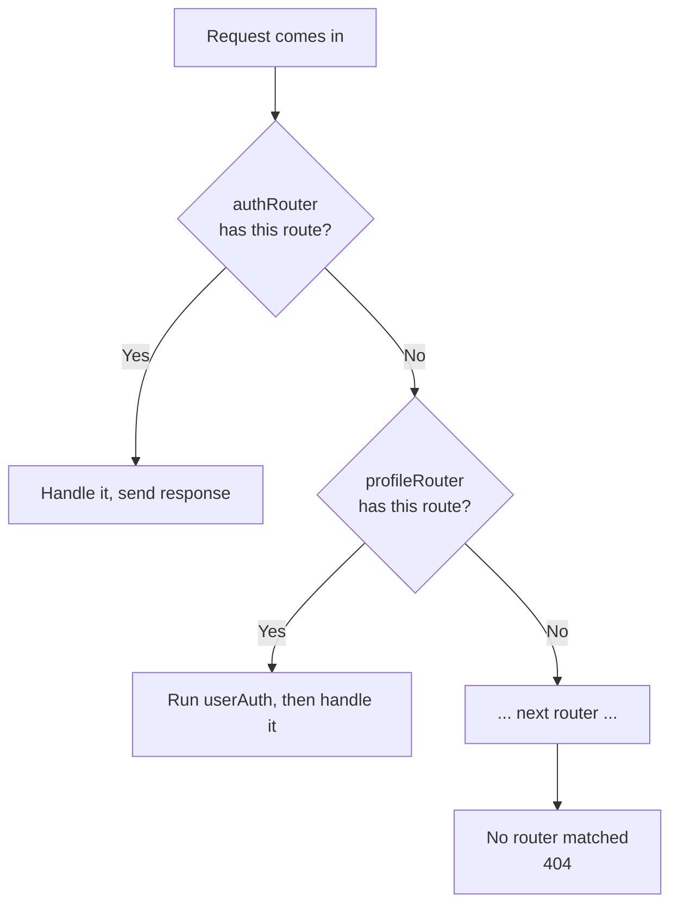

# Express Router

## What is express.Router

- `express.Router` is an instance of middleware and routes
- It works almost like a server instance, with negligible difference. You can use it like a server instance

```js
const app = express(); // approx. equal to
const router = express.Router();
```

- It helps you refactor and organize, grouping the routes into separate files
- One real difference: a Router cannot run on its own. It has no `.listen()` and no server settings. It is only a mini middleware and routing unit that must be mounted on an app with `app.use(...)` to do anything. So a Router behaves like a server instance for defining routes, but unlike an app it cannot start a server by itself

## Creating a Router in a Separate File

- In a route file, create a router, attach the routes to it, and export it

```js
const express = require("express");
const { signupValidation } = require("../utils/validation");
const bcrypt = require("bcrypt");
const User = require("../models/user");

const authRouter = express.Router();

authRouter.post("/signup", async (req, res) => {
  try {
    if (!req.body) {
      throw new Error("Invalid body!");
    }
    const { firstName, lastName, emailId, password } = req.body;
    await signupValidation(req);
    const passwordHash = await bcrypt.hash(password, 10);

    const user = new User({
      firstName,
      lastName,
      emailId,
      password: passwordHash,
    });

    await user.save();
    res.send("User added successfully!");
  } catch (error) {
    res.send("ERROR: " + error.message);
  }
});

authRouter.post("/login", async (req, res) => {
  const { emailId, password } = req.body;

  try {
    const user = await User.findOne({ emailId: emailId });
    if (!user) {
      throw new Error("Invalid credentials");
    }

    const isPasswordValid = await user.validatePassword(password);

    if (!isPasswordValid) {
      throw new Error("Invalid credentials");
    }

    const token = await user.getJWT();

    res.cookie("token", token, { expires: new Date(Date.now() + 8 * 3600000) });
    res.send("Login successfully");
  } catch (error) {
    res.status(400).send("ERROR: " + error.message);
  }
});

authRouter.post("/logout", (req, res) => {
  res.cookie("token", null, {
    expires: new Date(Date.now()),
  });
  res.send("Logout successfully");
});

module.exports = authRouter;
```

- Logout works by overwriting the cookie with an already-expired date, so the browser drops it

Code: [routes/auth.js](../../dev-tinder/src/routes/auth.js)

## Mounting Routers in server.js

- Now all the APIs are in different files, but the server needs to know the routes to send the request
- For that, import all the routers in `server.js` and pass them as middleware

```js
const authRouter = require("./routes/auth");
const profileRouter = require("./routes/profile");

app.use("/", authRouter);
app.use("/", profileRouter);
```

- When a request comes, it checks the route in `authRouter`, then in `profileRouter`, and so on, checking each router until it finds the route



Code: [server.js](../../dev-tinder/src/server.js)

## Protecting a Router with Middleware

- You can pass a middleware before a router when mounting it, so every route in that router runs the middleware first

```js
app.use("/", userAuth, profileRouter);
```

- Here every profile route goes through `userAuth` first, so all of them are protected. The middleware attaches the logged in user to `req.user`, which the routes then use

```js
profileRouter.get("/profile/view", (req, res) => {
  try {
    const user = req.user;

    if (!user) {
      throw new Error("User not found, please login again");
    }
    res.send(user);
  } catch (error) {
    res.status(400).send("ERROR: " + error.message);
  }
});
```

Code: [server.js](../../dev-tinder/src/server.js), [routes/profile.js](../../dev-tinder/src/routes/profile.js)

## Sending a JSON Response

- You can send the response as JSON using `res.json`

```js
profileRouter.patch("/profile/edit", async (req, res) => {
  try {
    const { isEditAllowed, isURLValid } = validateProfileEditData(req);

    if (!isEditAllowed) {
      throw new Error("Invalid edit request!");
    }

    if (!isURLValid) {
      throw new Error("Please enter a valid photo url");
    }
    const loggedInUser = req?.user;

    // You can also do it like this, but this is not preferred:
    // const user = await User.findByIdAndUpdate(loggedInUser?.id, req.body);

    Object.keys(req.body).forEach((k) => (loggedInUser[k] = req.body[k]));

    await loggedInUser.save();
    res.json({
      message: `${loggedInUser.firstName} User updated successfully`,
      data: loggedInUser,
    });
  } catch (error) {
    res.status(400).send("ERROR: " + error.message);
  }
});
```

- The edit route copies the allowed fields from `req.body` onto the logged in user, saves, and returns the updated user in the JSON response
- You could also update using `User.findByIdAndUpdate(id, req.body)` (the commented line), but that is not preferred. Modifying the instance and calling `save()` is the good way, because `save()` runs the schema validations and any pre/post save hooks (middleware). `findByIdAndUpdate` skips those by default

Code: [routes/profile.js](../../dev-tinder/src/routes/profile.js)
