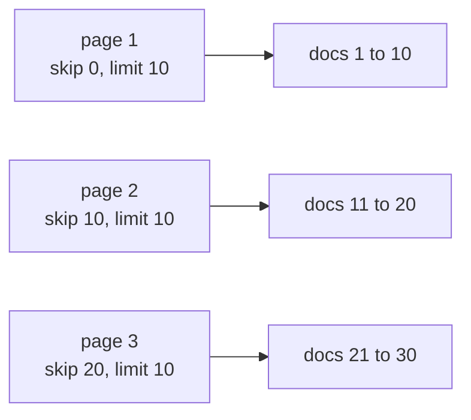

# DB Pagination

## Set Data Structure

- A `Set` is like an array, but it does not allow duplicates. If you try to add a duplicate, it just ignores it, so every value in a Set stays unique
- Useful when you need to collect ids without repeats, for example the list of users to hide from a feed

## select()

- `.select()` sends only the fields passed to it, instead of the whole document

```js
const requests = await ConnectionRequestModel.find({
  $or: [{ fromUserId: loggedInUser._id }, { toUserId: loggedInUser._id }],
}).select("fromUserId toUserId");
```

- This sends only `fromUserId` and `toUserId` in the response

## Why Pagination

- When your DB has hundreds of thousands of documents, sending them all in one API call takes more time
- To solve that, there is an option called pagination on APIs
- In a paginated API you send documents with some limit, then send the next set of documents by skipping the ones already sent

## skip() and limit()

- For pagination in MongoDB there are two functions, `skip()` and `limit()`. Both accept a number
  - **skip**: how many documents to skip from the start (from index 0)
  - **limit**: how many documents to send in the response
- By default, `skip` is 0 and `limit` is the total number of documents

## Building the Pagination Logic

- Generally you get the page number and limit from the request query

```text
http://localhost:3000/user/feed?page=1&limit=10
```

- Pass the limit number to `limit()` and build the logic for `skip`
- Set safe defaults so the API still works if the client omits the query: default `page` to 1 and `limit` to 10
- Cap the limit so a client cannot request a huge page and defeat pagination. Here the rule is: never send more than 50. If the request asks for more than 50, fall back to 10
- Clamp `page` to a minimum of 1 with `Math.max`, so a negative page cannot make `skip` negative (a negative skip makes MongoDB throw)
- Always `.sort()` before paginating. Without an explicit sort, MongoDB does not guarantee a consistent order between calls, so the same document could appear on two pages or be skipped at a page boundary. Sorting by `createdAt: -1` gives a stable newest-first order

```js
const page = Math.max(parseInt(req.query.page) || 1, 1);
let limit = parseInt(req.query.limit) || 10;
limit = limit > 50 ? 10 : limit;
const skip = (page - 1) * limit;

const data = await User.find({
  _id: { $nin: Array.from(hideUsersFromFeed) },
})
  .select(userSafeData)
  .sort({ createdAt: -1 })
  .skip(skip)
  .limit(limit);

res.json({ data });
```

- With `limit = 10`, the `skip = (page - 1) * limit` formula gives each page its own window of documents



Code: [routes/user.js](../../dev-tinder/src/routes/user.js)

## Pagination Metadata

- Along with `data`, send some metadata so the frontend knows where it is and whether there is more to load
- Put the query condition in a `filter` variable and reuse it for both `find()` and `countDocuments()`, so the total matches the data exactly
- `countDocuments()` counts every document that matches the filter, ignoring `skip` and `limit`, which is what you want for the total

```js
const filter = { _id: { $nin: Array.from(hideUsersFromFeed) } };

const total = await User.countDocuments(filter);

const data = await User.find(filter)
  .select(userSafeData)
  .sort({ createdAt: -1 })
  .skip(skip)
  .limit(limit);

res.json({
  data,
  pagination: {
    page,
    limit,
    total,
    totalPages: Math.ceil(total / limit),
    hasNextPage: page * limit < total,
    hasPrevPage: page > 1,
  },
});
```

- `totalPages`: `Math.ceil(total / limit)` rounds up, so 25 docs with limit 10 gives 3 pages
- `hasNextPage`: `page * limit < total` is true while the last item on this page is still below the total. Page 1 with limit 10 and total 25 gives `10 < 25` (true); the last page gives `30 < 25` (false)
- This costs one extra query (the count). For huge collections that is a small trade-off; for this app it is negligible

Code: [routes/user.js](../../dev-tinder/src/routes/user.js)

## Query Operators

- MongoDB has query operators that go inside a field's condition, written as `{ field: { $operator: value } }`
- The feed uses `$nin` to exclude a list of ids

```js
_id: { $nin: Array.from(hideUsersFromFeed) },
```

- Common operators:
  - `$in`: keeps a document only if its field value is **one of** the values in the array (show only these)
  - `$nin`: "not in", keeps a document only if its field value is **none of** the values in the array (show everything except these)
  - `$eq`: keeps a document only if its field value is **equal to** the given value
  - `$ne`: "not equal", keeps a document only if its field value is **not equal to** the given value
  - `$gt` / `$gte`: keeps a document only if its field value is **greater than** / **greater than or equal to** the given value
  - `$lt` / `$lte`: keeps a document only if its field value is **less than** / **less than or equal to** the given value

```js
// age greater than 18 and status not equal to "blocked"
User.find({ age: { $gt: 18 }, status: { $ne: "blocked" } });
```

- `$in` / `$nin` take an **array** of values, while `$eq` / `$ne` / the comparison operators take a **single** value

## Handling Corner Cases

- A paginated API takes `page` and `limit` straight from the query string, so never trust them blindly. Guard each case before building the query.
- Corner cases covered in the feed API:
  - **Missing query params**: `parseInt(req.query.page) || 1` and `parseInt(req.query.limit) || 10` fall back to sensible defaults, so the API still works with no query
  - **Negative page**: `Math.max(..., 1)` clamps `page` to at least 1, so `skip = (page - 1) * limit` can never go negative (a negative skip makes MongoDB throw)
  - **Oversized limit**: `limit > 50 ? 10 : limit` caps how many docs a client can pull in one call, so nobody can request a huge page and defeat pagination
  - **Don't show already-connected users**: a `Set` collects everyone the user has a request with, and `$nin` excludes them from the feed
  - **Don't show yourself**: the logged-in user's own `_id` is added to the hide set
  - **Don't over-fetch**: `.select(userSafeData)` returns only the safe fields, not the whole User document
