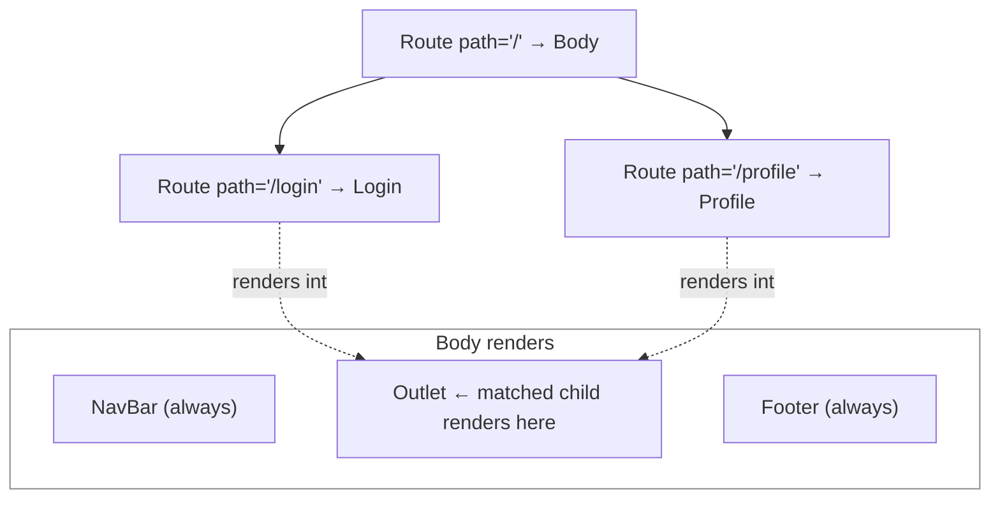

# Components and Routing (React Router)

## Split the UI into Components

- Don't write everything in one file like `App.jsx`. Create separate component files, export them, and import them using the ESM module architecture (`export default` / `import`)
- For example, move the navbar code out of `App.jsx` into its own `NavBar.jsx` component

```jsx
const NavBar = () => {
  return <div className="navbar bg-base-100 shadow-sm">{/* ... */}</div>;
};

export default NavBar;
```

Code: [components/NavBar.jsx](../../dev-tinder-web/src/components/NavBar.jsx)

## Setting Up React Router

- Once your UI is split across component files, you use `Route` to decide which component renders for a given path, so each path conditionally shows its own component
- For routing, use React Router. Install it with:

```text
npm i react-router-dom
```

- **Version note**: this project is on **react-router-dom v7**. In v7 you can import the router pieces from either `react-router-dom` (used here) or `react-router`; both work. Older tutorials (v5) had a different API (`Switch` instead of `Routes`, `component=` instead of `element=`), so if a tutorial uses `Switch`, it is an old version
- `basename` is the base path the app's routes point to. All routing is relative to this path, so you set it on `BrowserRouter`

```jsx
<BrowserRouter basename="/">
  <Routes>
    <Route path="/" element={<div>Base page</div>} />
    <Route path="/login" element={<div>Login page</div>} />
  </Routes>
</BrowserRouter>
```

- `Routes` is the wrapper for all the routes
- `Route` creates a single route. It takes a `path` and an `element`: on that path, the element is rendered conditionally

## Changing Routes Affects SEO

- Routing is important: if you change the routes after publishing, you can hit SEO problems. For some time the old routes stay indexed, so visitors land on them and get not-found errors

## Nested Routes (Parent and Child)

- When you have many pages and each one needs a shared header/navbar and footer, use parent and child routes
- Make one component the parent (here `Body`) and nest the pages inside it as children. You can have any number of children

```jsx
<BrowserRouter basename="/">
  <Routes>
    <Route path="/" element={<Body />}>
      <Route path="/login" element={<Login />} />
      <Route path="/profile" element={<Profile />} />
    </Route>
  </Routes>
</BrowserRouter>
```

- **Relative vs absolute child paths**: in React Router v6/v7 the idiomatic way to write a child path is **relative** (`path="login"`), not absolute (`path="/login"`). The absolute form works here only because the parent path is `/`. If the parent were `/user`, then `path="profile"` would resolve to `/user/profile`, while `path="/profile"` would stay at the root

```jsx
// Parent path "/user": relative children join onto it
<Route path="/user" element={<Body />}>
  <Route path="profile" element={<Profile />} />   {/* → /user/profile */}
  <Route path="settings" element={<Settings />} /> {/* → /user/settings */}
</Route>
```

Code: [App.jsx](../../dev-tinder-web/src/App.jsx)

## Rendering Children with Outlet

- To render the child routes, the parent uses the `Outlet` component from React Router. The matched child renders wherever you place `<Outlet />`

```jsx
import { Outlet } from "react-router-dom";
import NavBar from "./components/NavBar";
import Footer from "./components/Footer";

const Body = () => {
  return (
    <div className="flex flex-col min-h-screen">
      <NavBar />
      <main className="grow">
        <Outlet />
      </main>
      <Footer />
    </div>
  );
};

export default Body;
```

- Any child route of `Body` now renders inside the `<Outlet />`
- Put common things like the navbar above and the footer below the `Outlet`, so they stay consistent across every page of the application



Code: [Body.jsx](../../dev-tinder-web/src/Body.jsx), [components/Footer.jsx](../../dev-tinder-web/src/components/Footer.jsx)
