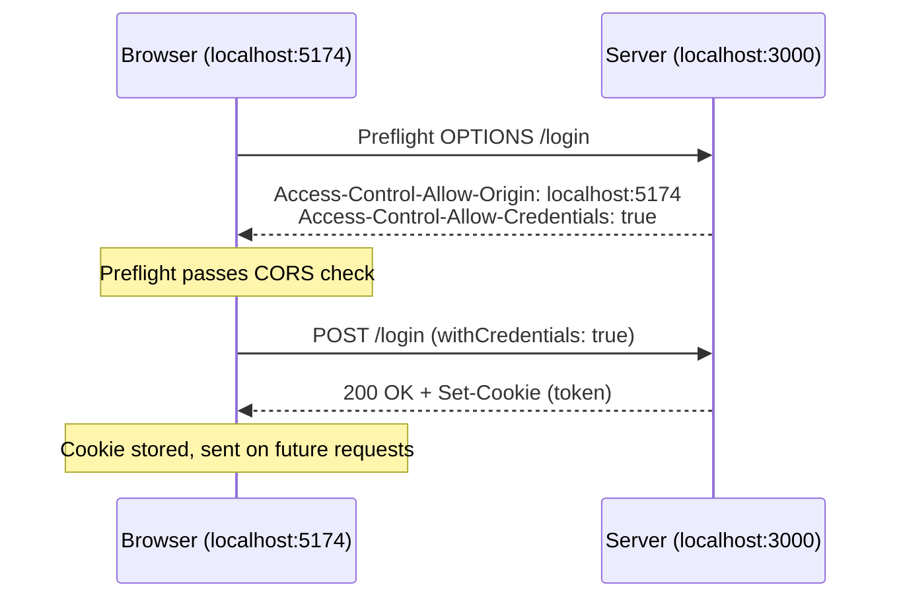

# State, Axios, and CORS

## State with the useState Hook

- In a functional React component, you create state variables using the `useState` hook

```jsx
const [emailId, setEmailId] = useState("");
const [password, setPassword] = useState("");
```

- `emailId` is the state variable that stores the data
- `setEmailId` is the setter function used to update the state variable
- You can pass a pre-defined or default value to the state variable (the argument to `useState`)

## Binding State to Input Fields

- To capture what the user types in a text field, use the `onChange` handler and give it a callback. It receives an event object, and you read the value from it

```jsx
<input
  type="text"
  value={emailId}
  onChange={(e) => setEmailId(e.target.value)}
  className="input w-full focus:outline-none"
  placeholder="Enter your email"
/>
```

- Every keystroke fires `onChange`, which stores the new value in the state variable. Since the input's `value` comes from that same state, the field and the state always stay in sync. This link between the state and the UI is called binding

Code: [pages/Login.jsx](../../dev-tinder-web/src/pages/Login.jsx)

## Making API Calls with Axios

- To make an API call you need an npm library called axios

```text
npm i axios
```

- Axios takes the method (`get`, `post`, `put`, `delete`), the API URL, and the data

```jsx
const handleLogin = async () => {
  try {
    await axios.post("http://localhost:3000/login", {
      emailId,
      password,
    });
  } catch (error) {
    console.error(error);
  }
};
```

- Always use `try/catch` while doing API calls

## CORS

- When you try to call the API, you get the famous CORS error:

```text
Access to XMLHttpRequest at 'http://localhost:3000/login' from origin
'http://localhost:5174' has been blocked by CORS policy: Response to preflight
request doesn't pass access control check: No 'Access-Control-Allow-Origin'
header is present on the requested resource.
```

- **CORS** = Cross Origin Resource Sharing. It comes from browser security: by the rule, you cannot make a request to a different origin from another origin
- The browser allows data transmission between the same origin only. Even a difference in the port number counts as a different origin (an origin is protocol + host + port)
- So how do you tell the browser that the two are different origins but belong together? You handle that at the API level

## Handling CORS on the Backend

- To handle CORS, you need an npm library called cors

```text
npm i cors
```

- Use it as a global middleware, so every request goes through it

```js
const cors = require("cors");

const app = express();

app.use(cors());
```

- You can enable CORS for a single route by passing it as a middleware to that route instead of using it globally

```js
// CORS is enabled only for this route, not the whole app
app.get("/feed", cors(), (req, res) => {
  res.json({ message: "CORS enabled for this route only" });
});
```

- You can allow only certain origins by passing the `origin` in the configuration options, and you can add more restrictions using other configuration options

Code: [dev-tinder/src/server.js](../../dev-tinder/src/server.js)

## CORS with Cookies (Credentials)

- If you use cookies, you can get an "invalid token" error even when you are logged in
- On localhost you get the token in the response header, but the cookie is not set in the browser the way it is in Postman
  - Check here: browser > dev tools > Application > Cookies
- By default the browser does not send or set cookies on a cross-origin request unless both sides opt in
- To fix this, allow credentials in the cors configuration, and set the exact `origin` (with `credentials: true`, the origin cannot be `*`, it must be the specific URL)

```js
app.use(
  cors({
    origin: "http://localhost:5174",
    credentials: true,
  }),
);
```

- This API change alone does not let the browser set the cookies. The request side must accept credentials too, using `withCredentials: true`

```jsx
await axios.post(
  "http://localhost:3000/login",
  {
    emailId,
    password,
  },
  { withCredentials: true },
);
```



Code: [pages/Login.jsx](../../dev-tinder-web/src/pages/Login.jsx), [dev-tinder/src/server.js](../../dev-tinder/src/server.js)
