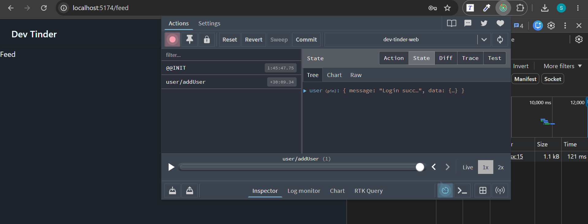
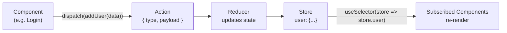

# Redux (State Management)

## What is Redux

- Redux is a state management library. If you store the data in Redux, you can use it anywhere in the application
- To use Redux, install two npm libraries: Redux Toolkit and React Redux

```text
npm install @reduxjs/toolkit react-redux
```

## Create the Store

- First, create a centralized place to store the data, using `configureStore`

```js
import { configureStore } from "@reduxjs/toolkit";

const appStore = configureStore({});

export default appStore;
```

## Provide the Store to the App

- Now give the whole application access to the store by wrapping it in `Provider` and passing the store
- Only the components inside `<Provider>` can read the store, so wrap whatever part needs it. Wrapping the whole app, as here, gives every component access

```jsx
import { Provider } from "react-redux";
import appStore from "./utils/appStore";

const App = () => {
  return (
    <div>
      <Provider store={appStore}>
        <BrowserRouter basename="/">
          <Routes>
            <Route path="/" element={<Body />}>
              <Route path="/login" element={<Login />} />
              <Route path="/profile" element={<Profile />} />
            </Route>
          </Routes>
        </BrowserRouter>
      </Provider>
    </div>
  );
};

export default App;
```

Code: [App.jsx](../../dev-tinder-web/src/App.jsx)

## Create a Slice

- A slice holds one piece of the state along with the reducers that change it. Create it with `createSlice`

```js
import { createSlice } from "@reduxjs/toolkit";

const userSlice = createSlice({
  name: "user",
  initialState: null,
  reducers: {
    addUser: (state, action) => {
      return action.payload;
    },
    removeUser: (state, action) => {
      return null;
    },
  },
});

export const { addUser, removeUser } = userSlice.actions;

export default userSlice.reducer;
```

- `name`: the name of the slice
- `initialState`: the starting value of this piece of state
- `reducers`: functions that update the state. Each one receives `(state, action)`, and the `action.payload` carries the data you dispatched
- `userSlice.actions` gives you the action creators (`addUser`, `removeUser`); `userSlice.reducer` is the reducer you add to the store
- `removeUser` does not use `action`, so it can be written more simply as `removeUser: () => null`
- Redux Toolkit uses Immer under the hood, so a reducer can either **return a new value** (like `return action.payload` here) or **mutate `state` directly** (like `state.name = action.payload`). Both are valid; direct mutation is handy for updating one field of nested state without rebuilding the whole object

```js
reducers: {
  // return a new value: replaces the whole state
  addUser: (state, action) => action.payload,

  // mutate state directly: Immer keeps it immutable for you
  updateName: (state, action) => {
    state.name = action.payload;
  },
}
```

Code: [utils/userSlice.js](../../dev-tinder-web/src/utils/userSlice.js)

## Add the Slice to the Store

- Register the slice's reducer in the store under a key. That key is how you read it back later (`store.user`)

```js
import { configureStore } from "@reduxjs/toolkit";
import userReducer from "./userSlice";

const appStore = configureStore({
  reducer: {
    user: userReducer,
  },
});

export default appStore;
```

- `configureStore` also auto-enables the **Redux DevTools** browser extension, so you can watch actions and state changes live while debugging
- Install it here: [Redux DevTools (Chrome Web Store)](https://chromewebstore.google.com/detail/redux-devtools/lmhkpmbekcpmknklioeibfkpmmfibljd)



Code: [utils/appStore.js](../../dev-tinder-web/src/utils/appStore.js)

## Dispatch an Action to Add Data

- To put data into the store, dispatch an action using the `useDispatch` hook

```jsx
import { useDispatch } from "react-redux";
import { addUser } from "../utils/userSlice";

const dispatch = useDispatch();

const handleLogin = async () => {
  try {
    const res = await axios.post(
      "http://localhost:3000/login",
      {
        emailId,
        password,
      },
      { withCredentials: true },
    );
    dispatch(addUser(res.data));
  } catch (error) {
    console.error(error);
  }
};
```

- The same way, on logout you dispatch `removeUser()` to clear the user from the store, after calling the backend `/logout` to clear the cookie

```jsx
import { useDispatch } from "react-redux";
import { removeUser } from "../utils/userSlice";

const dispatch = useDispatch();

const handleLogout = async () => {
  try {
    await axios.post(
      "http://localhost:3000/logout",
      {},
      { withCredentials: true },
    );
    dispatch(removeUser());
    navigate("/login");
  } catch (error) {
    console.error(error);
  }
};
```

Code: [pages/Login.jsx](../../dev-tinder-web/src/pages/Login.jsx), [components/NavBar.jsx](../../dev-tinder-web/src/components/NavBar.jsx)

## Read Data from the Store

- You access the data by subscribing to the store with the `useSelector` hook

```jsx
const user = useSelector((store) => store.user);
console.log(user);
```

- Now any change in the store reflects in every component subscribed to it
- For example, the `NavBar` reads the logged-in user this way and re-renders automatically when the store changes (for instance, to show the user's avatar after login)

```jsx
// inside NavBar
const user = useSelector((store) => store.user);
```

Code: [components/NavBar.jsx](../../dev-tinder-web/src/components/NavBar.jsx)



## State Resets on Refresh

- Redux state lives in memory, so when you refresh the page the store resets and `user` becomes `null` again, even though your login cookie/token is still valid
- This is the classic "why did my navbar user disappear after refresh?" problem
- The fix is to re-fetch the profile when the app loads (for example, call `/profile` in `App` or `Body`, then `dispatch(addUser(...))` to repopulate the store)

## Navigate Between Pages

- You can navigate to other pages using the `useNavigate` hook: just pass the path to it

```jsx
import { useNavigate } from "react-router-dom";

const navigate = useNavigate();

navigate("/feed");
```
