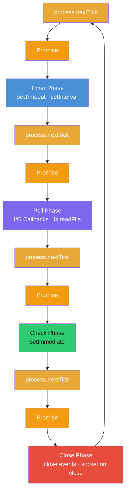

# Episode 06: libuv & Event Loop

## What's Inside libuv

libuv is the reason Node.js is capable of non-blocking I/O. Inside libuv there are three main components:

- **Event Loop**: manages async operations and ensures callbacks are executed at the right time
- **Callback Queue**: where callbacks are stored after an asynchronous operation is completed
- **Thread Pool**: handles time-consuming tasks that cannot be processed within the event loop without blocking it, such as file system operations or cryptographic functions

## Callback Queue

When an async operation gives a result, if the JS engine is busy at that moment, the callback function is held in the callback queue.

The event loop checks the callback queue and call stack continuously. If callbacks are present and the call stack is empty, it pushes the callbacks to the call stack for execution.

## Event Loop

When multiple callbacks are in the callback queue, the event loop prioritizes them by phase order. Each phase has its own callback queue.

### Event Loop Phases

The event loop moves through these phases one by one in a continuous circular manner:



1. **Timer Phase**: all `setTimeout` and `setInterval` callbacks in the queue are executed.
2. **Poll Phase**: all I/O callbacks are executed. When you perform a file read using `fs.readFile`, the associated callback executes here. This is the most important phase in the event loop.
3. **Check Phase**: `setImmediate` callbacks are executed. This allows callbacks to run immediately after the Poll phase.
4. **Close Phase**: all closing operation callbacks are executed, such as closing sockets (`socket.on("close")`). Used for cleanup tasks.

### Microtask Queues (process.nextTick and Promises)

Before the event loop moves to each phase, it first checks and executes all pending microtasks in this order:

1. `process.nextTick()` queue: all callbacks are executed first
2. Promise callback queue: all callbacks are executed next

```js
const fs = require("fs");
const a = 100;

setImmediate(() => console.log("setImmediate"));

Promise.resolve().then(() => console.log("Promise"));

fs.readFile("./file.txt", "utf8", () => {
  console.log("fs.readFile");
});

setTimeout(() => console.log("setTimeout"), 0);

process.nextTick(() => console.log("process.nextTick"));

function printA() {
  console.log("printA:", a);
}

printA();
console.log("Last line of the file");
```

Output order:

```text
printA: 100
Last line of the file
process.nextTick
Promise
setTimeout
setImmediate
fs.readFile
```

[example-02.js](../examples/06-libuv-event-loop/example-02.js)

## Event Loop Waiting at Poll Phase

The event loop pauses at the Poll phase when everything is idle. Idle here means the call stack is empty and every queue is empty, but libuv is still busy with a pending task (for example, waiting for the OS to finish reading a file). Instead of looping endlessly, the event loop simply waits at this phase until that result is ready. As soon as the result arrives, it picks up the callback and continues.

## Callbacks Scheduled Inside an I/O Callback

When you schedule new callbacks (`setTimeout`, `process.nextTick`, `setImmediate`) from inside an `fs.readFile` callback, they are queued while the event loop is already in the Poll phase. The order they run in shows how the event loop continues from that point:

- `process.nextTick` runs first, because microtasks are executed before moving on.
- `setImmediate` runs next, because the Check phase comes right after the Poll phase.
- `setTimeout` runs last, because the Timer phase only comes around in the next loop cycle.

```js
const fs = require("fs");

setImmediate(() => console.log("setImmediate"));

setTimeout(() => console.log("setTimeout"), 0);

Promise.resolve().then(() => console.log("Promise"));

fs.readFile("./file.txt", "utf8", () => {
  setTimeout(() => console.log("setTimeout inside fs.readFile"), 0);

  process.nextTick(() => console.log("process.nextTick inside fs.readFile"));

  setImmediate(() => console.log("setImmediate inside fs.readFile"));

  console.log("fs.readFile");
});

process.nextTick(() => console.log("process.nextTick"));

console.log("Last line of the file");
```

Output order:

```text
Last line of the file
process.nextTick
Promise
setTimeout
setImmediate
fs.readFile
process.nextTick inside fs.readFile
setImmediate inside fs.readFile
setTimeout inside fs.readFile
```

[example-03.js](../examples/06-libuv-event-loop/example-03.js)

## Nested process.nextTick

If a `process.nextTick` is called inside another `process.nextTick` callback, all `nextTick` callbacks are fully executed first before the event loop only then moves to the promise queue.

```js
process.nextTick(() => {
  process.nextTick(() => console.log("Inner process.nextTick"));
  console.log("process.nextTick");
});
```

Output order:

```text
process.nextTick
Inner process.nextTick
```

[example-04.js](../examples/06-libuv-event-loop/example-04.js)
