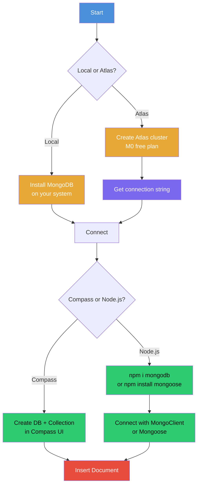

# Episode 10: MongoDB

## What is MongoDB?

MongoDB is a very popular **NoSQL database**.

## Two Ways to Use MongoDB

There are two main ways to use MongoDB:

1. **Install MongoDB locally**: download the MongoDB package, install it on your system, and use it directly from your local environment.
2. **Use MongoDB Atlas (managed cloud)**: instead of installing locally, you let MongoDB manage the database for you in the cloud. This works on both the Community and Enterprise versions of MongoDB.



### MongoDB Editions

- **Community Edition**: a free version, ideal for developers and personal projects.
- **Enterprise Edition**: designed for companies, offering advanced features and support.

### Why Use MongoDB Atlas?

- **No server management**: MongoDB handles all the database infrastructure and scaling for you.
- **Easy transition to production**: you can move from local development to production with minimal effort.

## Setting Up MongoDB Atlas

1. **Visit the MongoDB website**: go to [mongodb.com](https://www.mongodb.com/) and click "Try Atlas Free". Sign up if you do not have an account.
2. **Choose the Free Plan (M0)**: after signing up, select the **M0 plan**, which is free forever.
3. **Configure your cluster**:
   - **Cluster Name**: give a name to your cluster.
   - **Automatic Security Setup**: enable this to automatically configure security.
   - **Sample Dataset**: preload a sample dataset to experiment with.
4. **Cloud Provider and Region**: choose between AWS, Google Cloud, or Azure, and pick a region close to you.
5. **Create a Deployment**: MongoDB Atlas provides a **username and password** for accessing the cluster. Save these credentials. You can create multiple database users if needed.

## Getting the Connection String

- After creating your cluster, click the **Connect** button to get your connection string.
- Create a `database.js` file in your project and paste your connection string there.

### Connection Methods

MongoDB Atlas offers several ways to connect:

- **Drivers**: access your data using MongoDB's native drivers (Node.js, Go, etc.).
- **Compass**: explore, modify, and visualize your data with MongoDB's GUI.
- **Shell**: quickly add and update data using MongoDB's JavaScript command-line interface.
- **MongoDB for VS Code**: work with your data directly from VS Code.
- **Atlas SQL**: connect SQL tools to Atlas for data analysis and visualization.

## Using MongoDB Compass

You can access the data through tools like **Compass**.

- Download Compass, then create a new connection using the connection string. You get UI access to your cluster.
- From there you can create databases, view the data, and more.

### Creating a Database and Collection

- In Compass, click **+ Create Database** and provide a database name and a collection name (a collection is similar to a table in SQL databases).
- **Note**: do not check the **Time-Series** option unless you need it.

### Inserting a Document

- Insert the document from there. A document is like a JS object, and MongoDB gives a unique `_id` to every document.

```json
{
  "_id": {
    "$oid": "6a465c5fbaf4f967e68fd8ba"
  },
  "firstname": "Suresh",
  "lastname": "Javvadi",
  "city": "Vizag"
}
```

## Connecting Through Node.js

To connect to the cluster through Node.js, we need an NPM package:

```bash
npm i mongodb
```

### What is NPM?

**NPM (Node Package Manager)** is a repository of packages (node modules) that you can use in your Node.js applications. It is essentially a package manager for Node.js.

### Code Example

Replace `<db_password>` in the connection string with your actual database user password before running the file.

```js
const { MongoClient } = require("mongodb");

const url =
  "mongodb+srv://sureshjavvadi:<db_password>@learningnode.p0acwhb.mongodb.net/";

const client = new MongoClient(url);

const dbName = "helloWorld";

async function main() {
  await client.connect();
  console.log("Connected to MongoDB");

  const db = client.db(dbName);
  const collection = db.collection("user");

  const insertResult = await collection.insertMany([
    {
      firstName: "Surya",
      lastName: "J",
      city: "Hyderabad",
    },
  ]);

  console.log("Inserted resulted", insertResult);

  const findResults = await collection.find({}).toArray();
  console.log("Found documents =>", findResults);

  const countResult = await collection.countDocuments();
  console.log("Total documents in collection =>", countResult);

  const findResult = await collection.find({ firstName: "Surya" }).toArray(); // It will give the cursor object
  console.log("Found documents =>", findResult);

  const updateResult = await collection.updateOne(
    { firstName: "Surya" },
    { $set: { city: "Bangalore" } },
  );
  console.log("Updated documents =>", updateResult);

  return "done.";
}

main()
  .then(console.log)
  .catch(console.error)
  .finally(() => client.close());
```

[database.js](../examples/10-mongodb/database.js)

## Using Mongoose (ODM)

To make life easier when connecting to MongoDB, you can use **Mongoose**, an Object Data Modeling (ODM) library for MongoDB and Node.js. It simplifies interaction with MongoDB by providing schema-based solutions for modeling your data and handling queries.

Install Mongoose:

```bash
npm install mongoose
```

In your `database.js` file, you can use the following code to connect to your MongoDB cluster using Mongoose:

```js
const mongoose = require("mongoose");

// Connection URL (replace <username>, <password>, and <your-cluster-url> with your actual values)
const mongoURI =
  "mongodb+srv://<username>:<password>@<your-cluster-url>/<dbname>?retryWrites=true&w=majority";

const connectDB = async () => {
  try {
    await mongoose.connect(mongoURI, {
      useNewUrlParser: true,
      useUnifiedTopology: true,
    });
    console.log("MongoDB connected successfully!");
  } catch (error) {
    console.error("Error connecting to MongoDB:", error.message);
    process.exit(1); // Exit process with failure
  }
};

module.exports = connectDB;
```

### Advantages of Using Mongoose

- **Schema Definitions**: Mongoose lets you define schemas for your collections, which helps enforce structure in your documents.
- **Built-in Validation**: Mongoose provides validation at the schema level, ensuring your data is clean and consistent.
- **Middleware**: you can use pre and post hooks in Mongoose for tasks like data validation, logging, or transforming data before saving.
