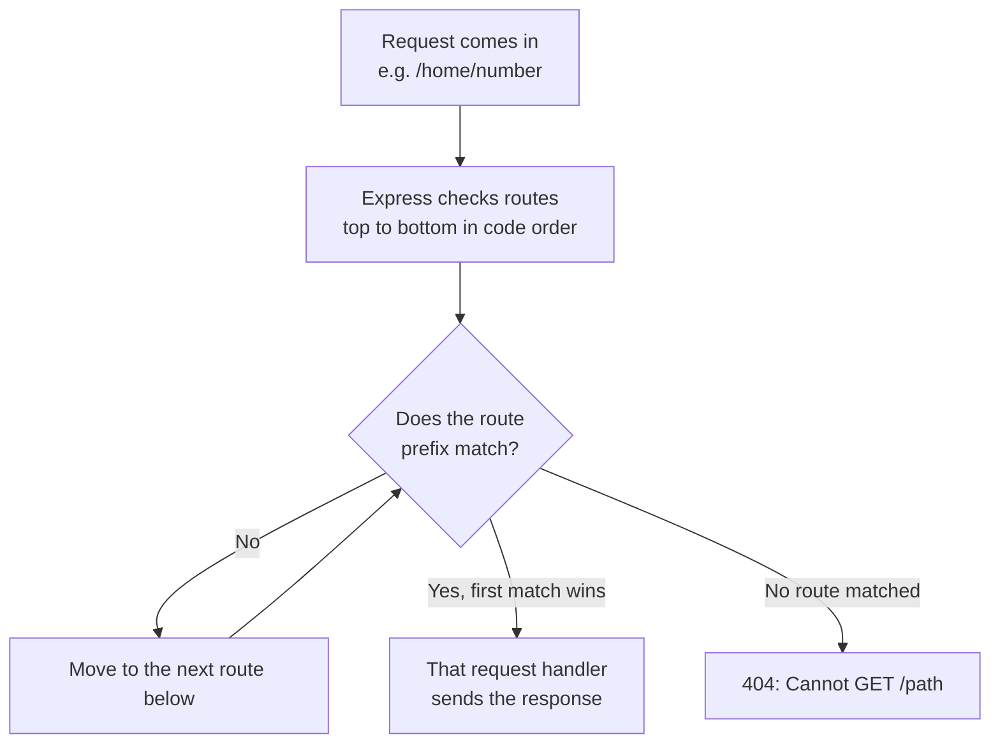
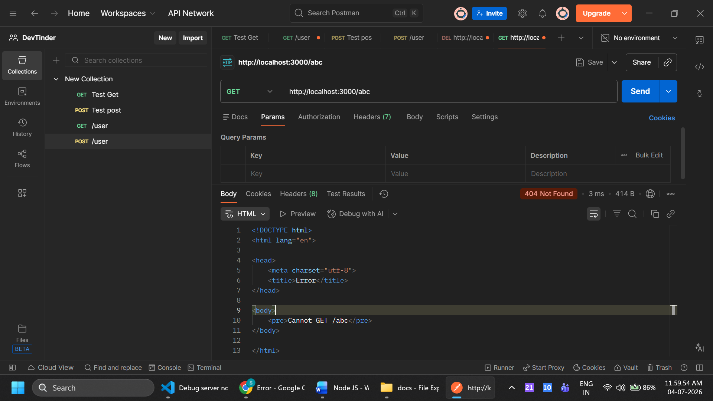

# Routing and Request

## Routing



- When a request comes in with a route, the first matching request handler sends the response
- `app.use("/home")` matches the path prefix by segments: if `/home` is defined first, then `/home/number`, or even `/home/a/b/c` at any depth, all get the same response as `/home`, because Express stops at the first matching prefix

```js
app.use("/home", (req, res) => {
  res.send("Home home home!"); // for home path
});

app.use("/home/number", (req, res) => {
  res.send("Home number number!");
});
```

- Even if you request `http://localhost:3000/home/number`, you get the response "Home home home!"
- The match is prefix based on path segments: `/home` also handles nested paths like `/home/q21/312`. But `/test123` is NOT handled by a `/test` route, because `/test123` is a different string
- Look carefully: if you give `/` in the route of a request handler, every request will get the response from that request handler, because every path starts with the `/` prefix

```js
app.use("/", (req, res) => {
  res.send("Hello from the server!"); // send response to every request, every path
});

app.use("/home", (req, res) => {
  res.send("Home home home!"); // for home path
});

app.use("/me", (req, res) => {
  res.send("Hello, I'm Suresh Javvadi!");
});
```

- Any request will get the response "Hello from the server!"
- This matching is also based on the order of the code written: from top to bottom it checks and matches the routes, and the first match found is the request handler that sends the data

```js
app.use("/home/number", (req, res) => {
  res.send("Home number number!");
});

app.use("/home", (req, res) => {
  res.send("Home home home!"); // for home path
});
```

- Here, by changing the order, both routes work because it checks and sends the first matching request handler response
- The order of writing routes is very important: it will change the server response

Code: [app.js](../dev-tinder/src/app.js)

## Request

- We have HTTP methods to make requests:
  - **GET**: to fetch the data. It is "safe" (does not alter server state) and "idempotent" (multiple identical requests have the same effect as a single one)
  - **POST**: to add the data. It is neither safe nor idempotent, repeated requests can create multiple resources
  - **PUT**: to update. It replaces the whole resource and is idempotent, sending the same PUT repeatedly results in the same resource state
  - **PATCH**: also for update, but a partial update. It only updates specific fields instead of replacing the entire resource
  - **DELETE**: to delete the data. It is idempotent, multiple DELETE requests for the same resource delete it only once
- By default, when you hit any URL in the browser, it makes a GET request
- The best way to test the remaining methods is Postman
- Install Postman, sign in, create a workspace, create a collection, and you can test all the requests and save them in the collections



- Here GET and POST give the same result, so we need to handle it in the server:

```js
// this will handle only get requests to the /user endpoint
app.get("/user", (req, res) => {
  res.send({
    firstName: "Suresh",
    lastName: "Javvadi",
  });
});
```

- Here it will respond to a GET call only
- That is the difference: `app.use()` matches every HTTP method (GET, POST, PUT, DELETE, etc.), while `app.get()` handles only GET requests
- Similarly, we need to handle POST, PUT, etc.

```js
app.post("/user", (req, res) => {
  res.send("Data has been posted to the server!");
});

app.delete("/user", (req, res) => {
  res.send("Data has been deleted from the server!");
});
```

### Specific routes before generic ones

- If you place a generic `app.use("/user")` before `app.get("/user")`, `app.post("/user")`, etc., Express matches it first:
- `app.use()` handles all HTTP methods and any route that starts with `/user` (like `/user/1` or `/user/profile`), so the method handlers are never reached
- To fix this, always place your specific routes before the generic ones, and keep the generic `app.use()` last

Code: [app.js](../dev-tinder/src/app.js)

## Advanced Routing

- Some advanced routing patterns, they may vary from version to version, current version 5.2.1:

```js
// b is optional to request, so this will handle both /ac and /abc
app.get("/a{b}c", (req, res) => {
  res.send("Hello, Hihii");
});
```

- Regex: the server can also respond based on a regex

```js
app.get(/^\/ab+c$/, (req, res) => {
  res.send("Hello from ab+c");
});
```

- You can send parameters in the URL: `/users?userid=20`, `/users?userid=20&password=testing`

```js
app.get("/users", (req, res) => {
  console.log(req.query);
  res.send({
    firstName: "Suresh",
    lastName: "Javvadi",
  });
});
```

- You can access them at `req.query`
- You can make the routes dynamic: `/username/123`

```js
app.get("/username/:userId", (req, res) => {
  console.log(req.params);
  res.send({
    firstName: "Suresh",
    lastName: "Javvadi",
  });
});
```

- You can access them at `req.params`
- You can also make more complex routes using multiple parameters, like `/user/:userId/:name/:password`: calling `/user/707/suresh/password` prints all three values in `req.params`

Code: [app.js](../dev-tinder/src/app.js)
