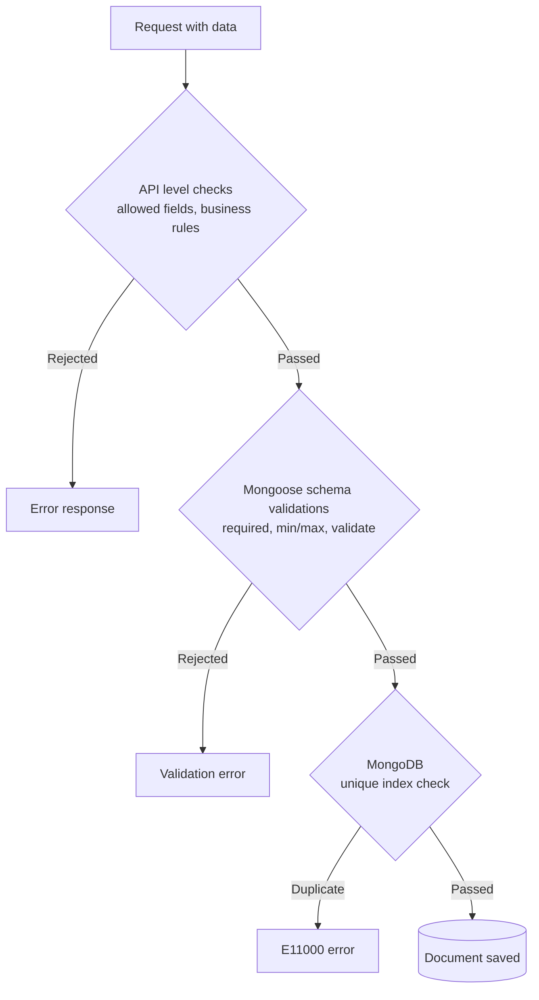
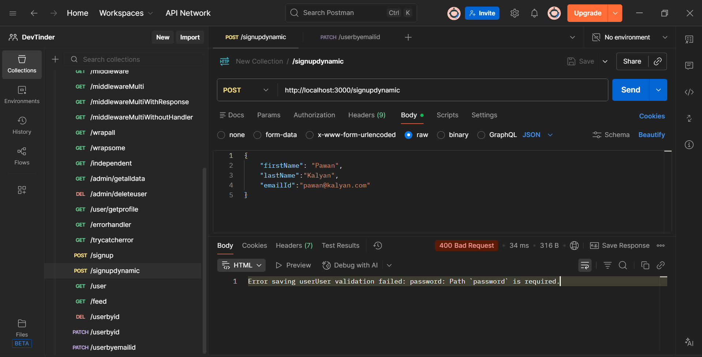

# Schema Data Validations

## Why Validations

- You can add strict checks before the data is added to the database
- You need to add the validations in both schemas and APIs. If those are not met, the data will not be added to the database
- When a request comes, always validate. Make the data fully sanitized before it goes to the database
- Validations are very important: almost every field requires validation, to stop the user from sending malicious data or crashing the database



## Schema Level Validations

### required

- `required`: takes a Boolean/function. If true, the field is mandatory

```js
firstName: {
  type: String,
  required: true,
},
```

- If those fields are not passed, the data will not be inserted into the document and it throws an error



### unique

- `unique`: takes a Boolean/function. If true, the field must be unique throughout the database

```js
emailId: {
  type: String,
  required: true,
  unique: true,
},
```

```text
Error saving userE11000 duplicate key error collection: dev_tinder.users index: emailId_1 dup key: { emailId: "pawan@kalyan.com" }
```

- Note: `unique` is not a Mongoose validation, it creates a **MongoDB unique index**. The E11000 error above comes from MongoDB itself, not from Mongoose (that is why its format looks different), and `runValidators` has no effect on it

### Other built-in validations

- `default`: adds the value to the field if it is passed empty
- `lowercase`: makes the value lowercase and adds it to the database
- `trim`: trims the data and inserts it
- `minLength` / `maxLength`: restrict the length of a String field
- `min` / `max`: restrict the range of a Number field
- You can also add multiple values in one field: give the type as an array

```js
skills: {
  type: [String],
},
```

- By default, Mongoose creates an empty array if you do not pass the data (this default comes from Mongoose, not MongoDB)

### validate

- `validate`: takes a function. You can add any custom validation in the validator function

```js
gender: {
  type: String,
  validate(value) {
    if (!["male", "female", "others"].includes(value)) {
      throw new Error("Gender is not valid");
    }
  },
},
```

- There are many more validations to use based on the scenario, you can find them in the [Mongoose validation documentation](https://mongoosejs.com/docs/validation.html)

### The full user schema from the project

```js
const userSchema = new mongoose.Schema(
  {
    firstName: {
      type: String,
      required: true,
      minLength: 3,
      maxLength: 40,
    },
    lastName: {
      type: String,
      minLength: 1,
      maxLength: 40,
    },
    emailId: {
      type: String,
      required: true,
      unique: true,
      trim: true,
      lowercase: true,
      validate(value) {
        if (!validator.isEmail(value)) {
          throw new Error("Email is not valid");
        }
      },
    },
    password: {
      type: String,
      required: true,
      minLength: 8,
    },
    age: {
      type: Number,
      min: 18,
    },
    gender: {
      type: String,
      validate(value) {
        if (!["male", "female", "others"].includes(value)) {
          throw new Error("Gender is not valid");
        }
      },
    },
    photoUrl: {
      type: String,
      default: "https://encrypted-tbn0.gstatic.com/images?q=...",
    },
    about: {
      type: String,
      default: "I am a developer",
      maxLength: 150,
    },
    skills: {
      type: [String],
    },
  },
  {
    timestamps: true,
  },
);
```

Code: [models/user.js](../dev-tinder/src/models/user.js)

## Validations on Update: runValidators

- By default, these validations work while creating new docs, meaning in the POST APIs
- To enable the validations while updating also, pass the `runValidators` option as true

```js
const user = await User.findByIdAndUpdate(userId, data, {
  runValidators: true,
});
```

- `default`: works on POST only, even when `runValidators` is true

## Timestamps

- You can add timestamps to every doc by passing a 2nd parameter to `mongoose.Schema`

```js
const userSchema = new mongoose.Schema(
  {
    // fields
  },
  {
    timestamps: true,
  },
);
```

- This will add `createdAt` and `updatedAt` to every doc and automatically update the values

Code: [models/user.js](../dev-tinder/src/models/user.js)

## API Level Validations

- Right now the APIs allow sending any object, and the matching schema fields get updated. But if you do not want to allow some fields, or want only a few fields to be updatable, then you need API level validations

```js
app.patch("/userbyidwithapivalidations", async (req, res) => {
  const userId = req.body.userId;
  const data = req.body;

  try {
    const allowedUpdates = [
      "userId",
      "age",
      "gender",
      "photoUrl",
      "about",
      "skills",
    ];

    const isUpdateAllowed = Object.keys(data).every((k) =>
      allowedUpdates.includes(k),
    );

    if (!isUpdateAllowed) {
      throw new Error("Update is not allowed");
    }

    const user = await User.findByIdAndUpdate(userId, data, {
      runValidators: true,
    });
    if (!user) {
      res.status(404).send("User not found");
    } else {
      res.send("User updated successfully");
    }
  } catch (error) {
    res.send("Update failed " + error.message);
  }
});
```

- So the API only allows those fields from `req.body`. If any other field is there, it will throw an error

### Getting the userId from the URL

- But we do not want to allow updating the userId, right? Yet the userId is needed to find the document
- To solve that, get the userId from the URL (route params), not from the body

```js
app.patch("/userbyidwithapivalidations/:userId", async (req, res) => {
  const userId = req.params?.userId;
  const data = req.body;

  try {
    const allowedUpdates = ["age", "gender", "photoUrl", "about", "skills"];

    const isUpdateAllowed = Object.keys(data).every((k) =>
      allowedUpdates.includes(k),
    );

    if (!isUpdateAllowed) {
      throw new Error("Update is not allowed");
    }

    if (data.skills && data.skills.length > 10) {
      throw new Error("Skill cannot be more than 10");
    }

    const user = await User.findByIdAndUpdate(userId, data, {
      runValidators: true,
    });
    if (!user) {
      res.status(404).send("User not found");
    } else {
      res.send("User updated successfully");
    }
  } catch (error) {
    res.send("Update failed " + error.message);
  }
});
```

- Note the extra custom check: you can add any business rule at the API level, like limiting `skills` to a maximum of 10 entries

Code: [app.js](../dev-tinder/src/app.js)

## The validator Library

- You can take the help of an external npm library called **validator** to offload the validations and skip writing the code yourself
- To install this library:

```text
npm i validator
```

```js
emailId: {
  type: String,
  required: true,
  unique: true,
  trim: true,
  lowercase: true,
  validate(value) {
    if (!validator.isEmail(value)) {
      throw new Error("Email is not valid");
    }
  },
},
```

- You can explore many more validations in the [validator documentation](https://www.npmjs.com/package/validator)

Code: [models/user.js](../dev-tinder/src/models/user.js)
