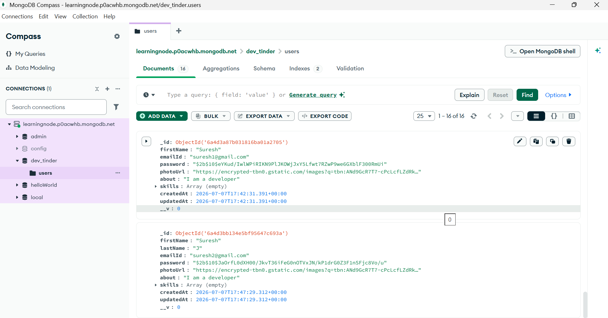
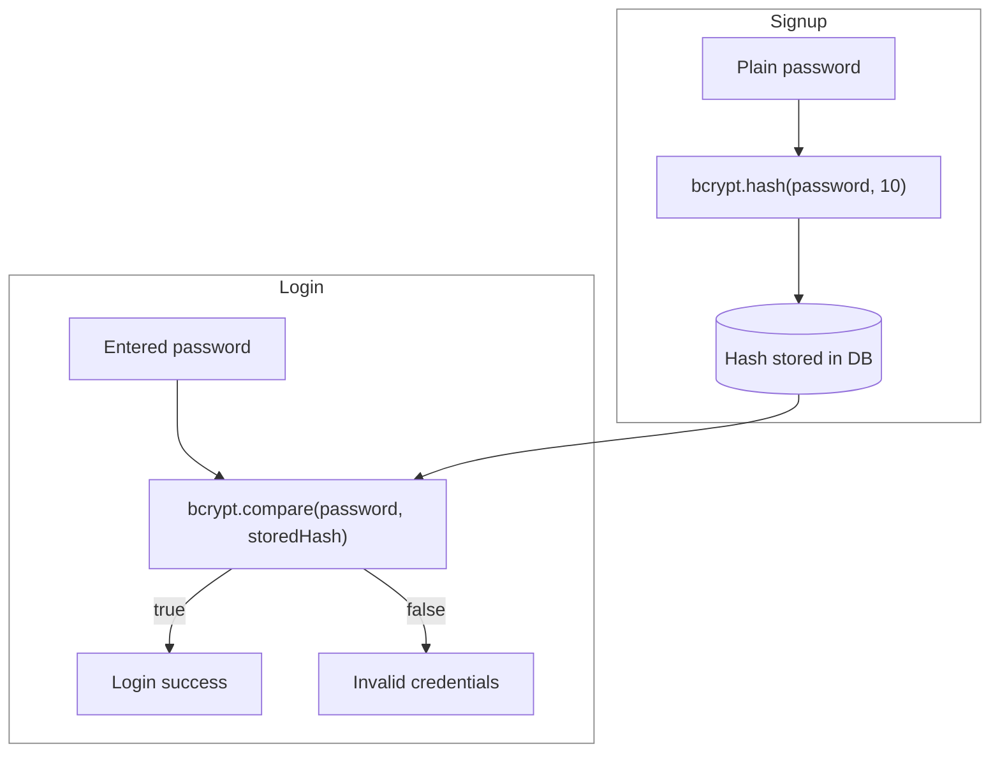

# Password Encryption

## Why Not Plain Passwords

- You should never save passwords in a readable format: it causes many security issues
- You need to store the encrypted form of the password. So at insert time, encrypt the password and pass it to the database
- What actually goes to the database is the **hash** of the password: even if someone gets access to the database, they see only hashes, and the original password is never recoverable from them

## Validating the Signup Data First

- Before touching the password, validate the incoming signup data. Keep the validation logic in a separate helper file and call it from the API

```js
const validator = require("validator");

const signupValidation = (req) => {
  const { firstName, lastName, emailId, password } = req.body;

  if (!firstName) {
    throw new Error("First name is required");
  }

  if (!validator.isEmail(emailId)) {
    throw new Error("Please enter a valid email");
  }

  if (!validator.isStrongPassword(password)) {
    throw new Error("Please enter the strong password");
  }
};

module.exports = { signupValidation };
```

Code: [utils/validation.js](../dev-tinder/src/utils/validation.js)

## Encrypting with bcrypt

- To encrypt the password, use an npm library called **bcrypt**. Install the library:

```text
npm i bcrypt
```

- It has two techniques to encrypt the password, find more in the [bcrypt documentation](https://www.npmjs.com/package/bcrypt)

```js
const bcrypt = require("bcrypt");

const encryptedPassword = await bcrypt.hash(password, 10);
```

- 1st parameter: pass your plain password
- 2nd parameter: the number of salt rounds
- It will give the hash for the password. Store that in the database: no one can figure out the password with the naked eye
- Note on terminology: bcrypt actually does **hashing**, not encryption.
  - Encryption is reversible (it can be decrypted)
  - Hash is one-way: nobody, including us, can turn the stored hash back into the password. That one-way property is exactly what makes it safe



- The full signup API with validation and encryption:

```js
app.post("/usersignup", async (req, res) => {
  const { firstName, lastName, emailId, password } = req.body;

  try {
    await signupValidation(req); // validate first
    const encryptedPassword = await bcrypt.hash(password, 10); // then hash
    const user = new User({
      firstName,
      lastName,
      emailId,
      password: encryptedPassword,
    });

    await user.save();
    res.send("User added successfully!");
  } catch (error) {
    res.send("ERROR: " + error.message);
  }
});
```

- Order matters: validate first, then hash. Hashing before validation wastes work on invalid data, and if the password is missing the hash call crashes before validation ever runs

Code: [app.js](../dev-tinder/src/app.js)

## Validating the Password on Login

- To compare or validate the user's password against the hash, use `bcrypt.compare()`. It returns a Boolean

```js
const isValidPassword = await bcrypt.compare(password, user.password);
```

- 1st parameter: pass the plain password
- 2nd parameter: the hash stored in the database

```js
app.post("/userlogin", async (req, res) => {
  const { emailId, password } = req.body;

  try {
    const user = await User.findOne({ emailId: emailId });
    if (!user) {
      throw new Error("Invalid credentials");
    }

    const isValidPassword = await bcrypt.compare(password, user.password);
    if (!isValidPassword) {
      throw new Error("Invalid credentials");
    }

    res.send("Login successfully");
  } catch (error) {
    res.status(400).send("ERROR: " + error.message);
  }
});
```

- Note: the error says "Invalid credentials" in both cases (user not found, wrong password). Never reveal which one failed, so an attacker cannot learn whether an email exists in the database



Code: [app.js](../dev-tinder/src/app.js)
