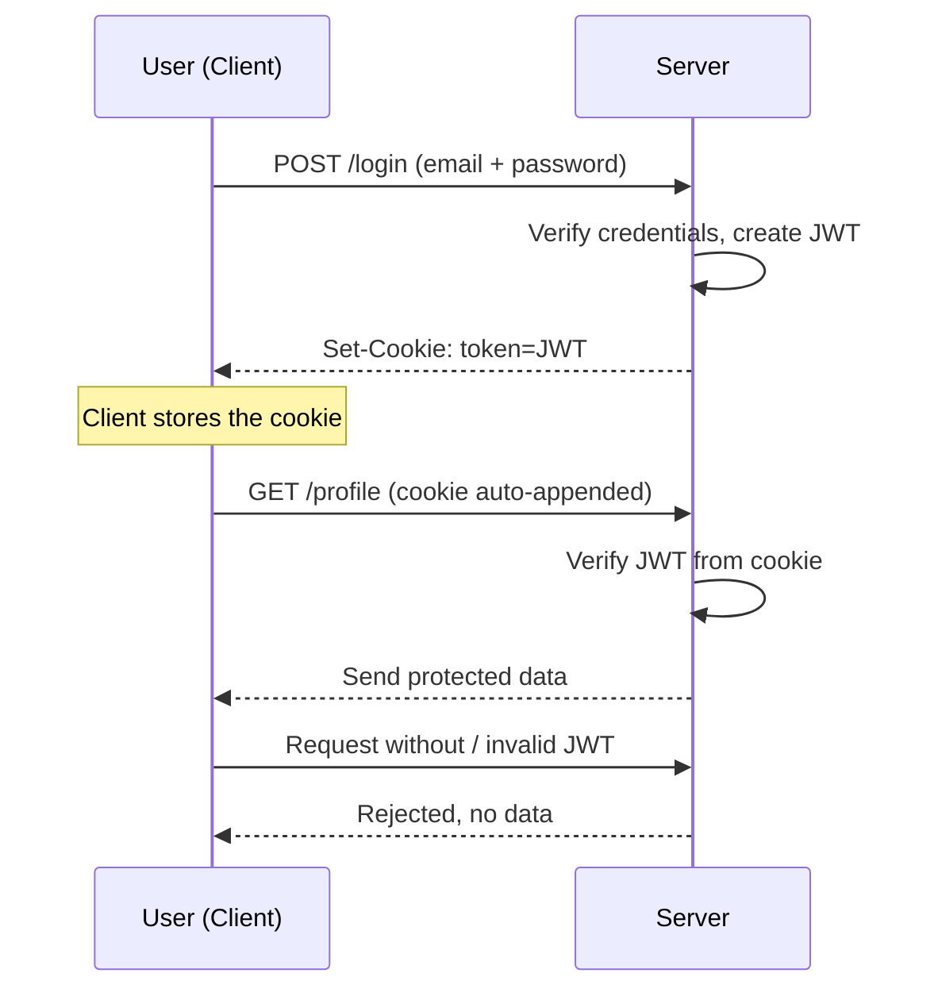

# Authentication and JWT

## Why Authentication

- When a client makes a request, the server sends the response and the connection closes as per the TCP/IP protocol
- But the server needs to send the data only to authorized requests. Otherwise your data will be exposed
- So to stop that, you need to validate every request to confirm whether to send the response

## How Authentication Works

- When the user logs in successfully, the server creates and sends a very unique token called a JWT to the user
- From now on, the user needs to append that JWT token to each request
- So when the request comes to the server, the server authenticates the request with the appended JWT
- If the request comes without a JWT, or the JWT mismatches, the data will not be sent
- The JWT is sent to the user wrapped in a cookie, so the client stores that cookie, and whenever a request happens the cookie is appended. The server validates the cookie and sends the data
- You can set the expiry time of the JWT: it can be seconds, minutes, hours, days, weeks, or no expiry



## Cookies and cookie-parser

- While the user logs in, check the email and password, then send the cookie

```js
res.cookie("token", "12345678900987654321");
res.send("Login successfully");
```

- You can find the cookie in `req.cookies`. But just like JSON, Express does not read the tokens on its own. To read the token, an external middleware is required called **cookie-parser**

```Shell
npm i cookie-parser
```

```js
const cookieParser = require("cookie-parser");

app.use(cookieParser());
```

Code: [app.js](../dev-tinder/src/app.js)

## JSON Web Token

- JWTs are the industry standard tokens to make secure connections
- You can decode any JWT token at [jwt.io](https://jwt.io)
- A JWT has three parts, separated by dots (`header.payload.signature`):
  - Header: metadata about the token, like the signing algorithm and token type
  - Payload: the actual data (your user details like `_id`) plus fields like expiry. This is only Base64 encoded, not encrypted, so never put secrets here
  - Signature: created from the header, payload, and your secret key. It is what proves the token was not tampered with, because only the server knows the secret
- To create a JWT, use an npm library called **jsonwebtoken**

```Shell
npm i jsonwebtoken
```

### Creating a token with jwt.sign

```js
const token = jwt.sign({ _id: user._id }, "Sxxxxxx");
```

- 1st parameter: user details like id, email
- 2nd parameter: your secret key. This is not known to anyone, not even the clients
- It will return a JWT that has the user details. Send the JWT as a cookie
- Note: `jwt.sign` is synchronous when you do not pass a callback. It returns the token string directly, not a Promise. Using `await` on it is harmless but misleading

### Validating a token with jwt.verify

```js
const decodeToken = jwt.verify(token, "Sxxxxxx");
```

- 1st parameter: token from the request
- 2nd parameter: your secret key
- It will return the user details passed while creating the JWT
- With those details, you can find whether the user is authorized or not, and decide to send the data or not
- Note: `jwt.verify` is also synchronous without a callback, so it returns the decoded payload directly, not a Promise

### Expiring the JWT

- To expire the JWT, add `expiresIn` while creating the JWT

```js
const token = await jwt.sign({ _id: user._id }, "Sxxxxxx", {
  expiresIn: "7d",
});
```

- The token will expire in 7 days. `expiresIn` accepts either a number or a time-string:
  - A plain number indicates seconds, e.g. `expiresIn: 60` is 60 seconds
  - `s` indicates seconds, e.g. `"30s"`
  - `m` indicates minutes, e.g. `"15m"`
  - `h` indicates hours, e.g. `"2h"`
  - `d` indicates days, e.g. `"7d"`
- After the expiry time passes, `jwt.verify` throws a `TokenExpiredError`, and the user has to log in again to get a fresh token
- If you do not pass `expiresIn` at all, the token never expires on its own

### Expiring the cookie

- You can expire cookies also: give the expiry time like time now + milliseconds

```js
res.cookie("token", token, { expires: new Date(Date.now() + 900000) });
```

- You can find the expiry date and time in the cookie

```text
token=exxxxxxxxxxxx.exxxxxxxxxxxxx.Gxxxxxx; Path=/; Expires=Wed, 08 Jul 2026 08:49:22 GMT;
```

- Note: the cookie expiry and the JWT expiry are two independent timers. Here the cookie expires in 15 minutes (`Date.now() + 900000`) while the JWT expires in 7 days (`expiresIn: "7d"`), so the cookie dies long before the token. Ideally keep the two aligned
- You can send multiple cookies in a single response
- The cookie has your info. With that cookie, anyone can access your data, so never ever share the cookies with anyone

Code: [app.js](../dev-tinder/src/app.js)

## Authentication Implementation

### Securing a Single API

- Read the token from the cookie, verify it, find the user, and only then send the data

```js
app.get("/profile", async (req, res) => {
  const { token } = req.cookies;

  try {
    if (!token) {
      throw new Error("Token is not valid!");
    }

    const decodeToken = await jwt.verify(token, "Sxxxxxx");

    const { _id } = decodeToken;

    const user = await User.findById(_id);

    if (!user) {
      throw new Error("User not found, please login again");
    }
    res.send(user);
  } catch (error) {
    res.status(400).send("ERROR: " + error.message);
  }
});
```

- Now only this API is secured: without the valid token, this API does not send the data
- The problem: this same block (read cookie, verify token, find user) has to be repeated inside every protected route, which is redundant. A middleware solves this by writing the auth logic once and reusing it across routes

Code: [app.js](../dev-tinder/src/app.js)

### Securing All APIs with a Middleware

- To make all APIs secured without code redundancy, implement the auth logic as a middleware instead of repeating it in every route

```js
const userAuth = async (req, res, next) => {
  const { token } = req.cookies;

  try {
    if (!token) {
      throw new Error("Invalid token!");
    }
    const decodedObj = await jwt.verify(token, "Sxxxxxx");

    const { _id } = decodedObj;

    const user = await User.findById(_id);

    if (!user) {
      throw new Error("User not found!");
    }
    req.user = user;
    next();
  } catch (error) {
    res.status(400).send("ERROR " + error.message);
  }
};
```

- Append the user object to `req`, so you can access the user object in the route via `req.user`
- Call `next()` to pass control to the next request handler, if there is no error
- Now just pass the middleware to any API, so that API will send the data only if the user is authorized

```js
app.post("/sendconnectionrequest", userAuth, async (req, res) => {
  res.send(req.user.firstName + " Send the Connection request");
});
```

Code: [app.js](../dev-tinder/src/app.js), [middlewares/auth.js](../dev-tinder/src/middlewares/auth.js)

## Mongoose Schema Methods

- Schema methods are helper methods related to the schema, used to refactor the code
- In the login API, you are creating the JWT for each and every user, so you can offload that to a user schema method

```js
userSchema.methods.getJWT = async function () {
  const token = await jwt.sign({ _id: this._id }, "Sxxxxxx", {
    expiresIn: "7d",
  });

  return token;
};
```

- Then in the login API, replace the inline `jwt.sign` with the schema method:

```js
// const token = await jwt.sign({ _id: user._id }, "Sxxxxxx", {
//   expiresIn: "7d",
// });

const token = await user.getJWT();
```

- Use traditional functions with the `function` keyword, not arrow functions, because you need `this` inside the method
- Why `this`? In a regular function, `this` refers to whatever object called the method. Calling `user.getJWT()` makes `this` equal to `user`, the schema instance (the logged in user). So you do not need to pass the user in as a parameter
- Why not an arrow function? Arrow functions do not have their own `this`, they inherit it from the surrounding scope. So `this` would not be the user, and `this._id` would be undefined. That is why the method must be a regular `function`
- You can offload the password check the same way, with a `validatePassword` method:

```js
userSchema.methods.validatePassword = async function (passwordInputByUser) {
  const isPasswordValid = await bcrypt.compare(
    passwordInputByUser,
    this.password,
  );

  return isPasswordValid;
};
```

- Then the login API becomes:

```js
const isPasswordValid = await user.validatePassword(password);
```

Code: [models/user.js](../dev-tinder/src/models/user.js), [app.js](../dev-tinder/src/app.js)
