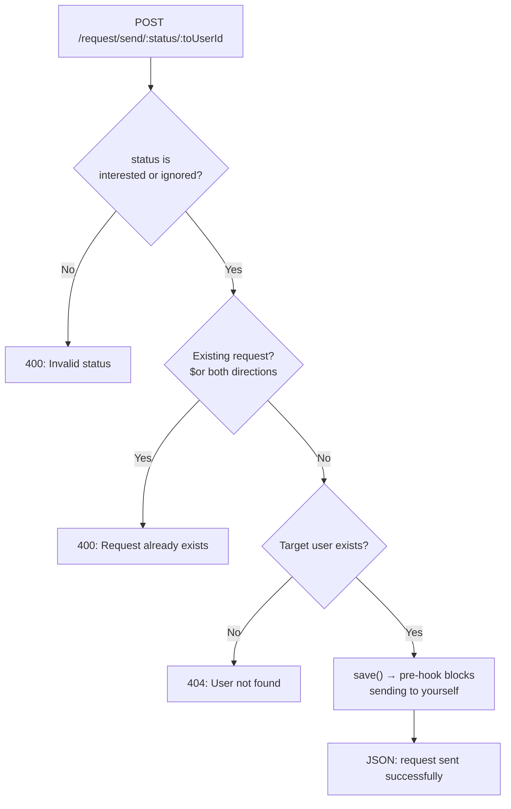

# DB Queries and Indexes

## ObjectId Type

- The type of `_id` is `mongoose.Schema.Types.ObjectId`
- Use this type for fields that reference another document's `_id` (like `fromUserId`, `toUserId`)

```js
fromUserId: {
  type: mongoose.Schema.Types.ObjectId,
  required: true,
},
```

## Enum

- `enum` allows the field to accept only those values, restricting it to a set of values
- To send a custom error message, use `"{VALUE} status is not allowed"`, where `{VALUE}` is replaced by the value that failed

```js
status: {
  type: String,
  required: true,
  enum: {
    values: ["interested", "ignored", "accepted", "rejected"],
    message: "{VALUE} status is not allowed",
  },
},
```

Code: [models/connectionRequest.js](../dev-tinder/src/models/connectionRequest.js)

## Logical Queries

### AND: comma

- In a MongoDB query, "AND" (`&&`) is equal to a comma (`,`)

```js
const existingRequest = await ConnectionRequestModel.findOne({
  fromUserId: fromUserId,
  toUserId: toUserId,
});
```

- Each condition is a separate key-value pair. When you have multiple conditions to follow, put them all inside the same object separated by commas. A document is returned only when all the conditions are satisfied, and that is the AND.
- Writing `{ fromUserId: fromUserId && toUserId: toUserId }` is invalid JavaScript and throws an error
- This comma form is the implicit AND. There is also an explicit `$and` operator (the twin of `$or`), which takes an array of condition objects:

```js
$and: [{ fromUserId: fromUserId }, { toUserId: toUserId }];
```

- You only need `$and` when the comma form cannot express it, for example two conditions on the same field, since a JS object cannot have the same key twice

### OR: $or

- "OR" (`||`) is equal to `$or`, which takes an array of condition objects

```js
const existingRequest = await ConnectionRequestModel.findOne({
  $or: [
    { fromUserId: fromUserId, toUserId: toUserId },
    {
      fromUserId: toUserId,
      toUserId: fromUserId,
    },
  ],
});
```

Code: [routes/request.js](../dev-tinder/src/routes/request.js)

## pre Save Middleware

- Like schema methods, there is a middleware called `pre`. It runs before `save()`

```js
connectionRequestSchema.pre("save", function (next) {
  if (this.fromUserId.equals(this.toUserId)) {
    throw new Error("Can't send request to yourself");
  }
  next();
});
```

- `next()` is needed on the success path to let the save continue (when `fromUserId` is not equal to `toUserId`). It is only skipped on the `throw` path, because the thrown exception aborts the save and control never reaches `next()`. In general, since this is a middleware, `next()` is what moves control to the next step



Code: [models/connectionRequest.js](../dev-tinder/src/models/connectionRequest.js), [routes/request.js](../dev-tinder/src/routes/request.js)

## Handling Corner Cases

- While writing an API, always think through all the corner cases to make the API safe. An attacker can send malicious or unexpected data, so never trust the input blindly. Guarding each case keeps the API safe.
- Corner cases covered in the send-request API:
  - **Authentication**: the router is mounted behind `userAuth`, so only a logged-in user can send a request
  - **Trust the token, not the input**: `fromUserId` comes from the verified JWT (`req.user._id`), never from the request body, so an attacker cannot spoof who the request is "from"
  - **Invalid status**: only `interested` and `ignored` are allowed. Values like `accepted` or `rejected` (which the receiver sets later) are blocked at the sender side
  - **Malformed `toUserId`**: `mongoose.Types.ObjectId.isValid(toUserId)` rejects a bad id with a clean 400 before any DB call, instead of letting Mongoose throw a `CastError` whose raw text would leak
  - **Duplicate request**: a `$or` query checks both directions, so the same pair cannot create a request twice (A → B or B → A)
  - **Non-existent target user**: `findById` on `toUserId` returns 404 if the user does not exist, so you cannot send a request to a random or fake id
  - **Sending a request to yourself**: the `pre("save")` hook throws when `fromUserId` equals `toUserId`
  - **Unique compound index**: `{ fromUserId: 1, toUserId: 1 }` is unique, so the database itself rejects a duplicate pair even if a check is bypassed

## Indexes

- Indexes help to query faster
- When your collection has millions of documents, then querying with `find` or `findOne` takes more time to return the results
- When indexes are created on those fields, queries on those fields return very fast
- To create an index for a field, just pass `index: true` as a schema type option. MongoDB will take care of the fast results

```js
firstName: {
  type: String,
  required: true,
  minLength: 3,
  maxLength: 40,
  index: true,
},
```

- If you make a field `unique`, then an index is created automatically for that field
- You can create indexes using these schema type options:
  - `index`
  - `unique`
  - `sparse`

### Compound Index

- A compound index is a combined index on two or more fields
- It helps you get fast results for AND (`,`) and OR (`$or`) queries

```js
connectionRequestSchema.index({ fromUserId: 1, toUserId: 1 });
```

- `1`: ascending order
- `-1`: descending order
- Using a compound index, you can also make a unique combination of multiple fields

```js
connectionRequestSchema.index({ fromUserId: 1, toUserId: 1 }, { unique: true });
```

- Make indexes smartly and only when required. Indexes speed up reads, but they slow down writes (every insert or update must also update the index) and use extra storage. That is why creating indexes unnecessarily is not good, it becomes tough for the DB to handle

Code: [models/connectionRequest.js](../dev-tinder/src/models/connectionRequest.js), [models/user.js](../dev-tinder/src/models/user.js)
