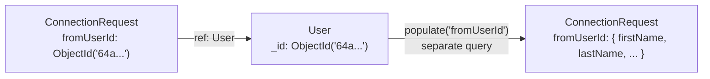

# Relations Between Collections

## Building Relations with `ref`

- When one collection needs data that lives in another, you connect them with a relation
- A relation keeps only the referenced document's `_id` (an ObjectId), not a copy of the whole document. This avoids duplication and keeps one source of truth: if the User updates their name, every request that references them reflects it automatically
- To create a relation, just add `ref: "ModelName"` as a schema type option. Mongoose then knows which model this id points to and can pull that document in for you with `populate()`, which runs a separate query under the hood

```js
fromUserId: {
  type: mongoose.Schema.Types.ObjectId,
  required: true,
  ref: "User",
},
```

- You need to pass a valid registered model name: the exact string you passed to `mongoose.model("User", userSchema)`, not the MongoDB collection name (`users`)
- It creates the link between `fromUserId` and `_id` in the User collection

Code: [models/connectionRequest.js](../dev-tinder/src/models/connectionRequest.js)

## Populate

- Now you can populate all the fields of the matching User document wherever `fromUserId` is used

```js
const requests = await ConnectionRequestModel.find({
  toUserId: loggedInUser._id,
  status: "interested",
}).populate("fromUserId", "firstName lastName age gender about skills");
```

- You can write the populate fields as an array of strings too, instead of a single space-separated string

```js
const requests = await ConnectionRequestModel.find({
  toUserId: loggedInUser._id,
  status: "interested",
}).populate("fromUserId", ["firstName", "lastName", "age", "gender", "about", "skills"]);
```

- If you don't send the second parameter, it populates all the fields of the User collection



### Populating Multiple References

- When a document has more than one reference, chain `.populate()` once per field

```js
const requests = await ConnectionRequestModel.find({
  $or: [{ fromUserId: loggedInUser._id }, { toUserId: loggedInUser._id }],
  status: "accepted",
})
  .populate("fromUserId", userSafeData)
  .populate("toUserId", userSafeData);
```

- Define the field list once as a reusable constant, instead of repeating it in every populate call

```js
const userSafeData = "firstName lastName age gender about skills";
```

### Traversing the Populated Object

- After `populate()`, the field is a full object, not just an id, so you can access its properties directly (`row.fromUserId._id`, `row.fromUserId.firstName`)

```js
const data = requests.map((row) => {
  if (row.fromUserId._id.toString() === loggedInUser._id.toString()) {
    return row.toUserId;
  }
  return row.fromUserId;
});
```

Code: [routes/user.js](../dev-tinder/src/routes/user.js)

## Don't Over-Fetch in GET APIs

- In GET APIs, make sure you don't over-fetch the data and send only the required fields
- You need to be very specific about what you are sending back
